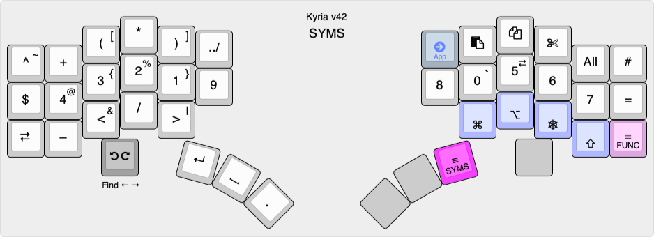
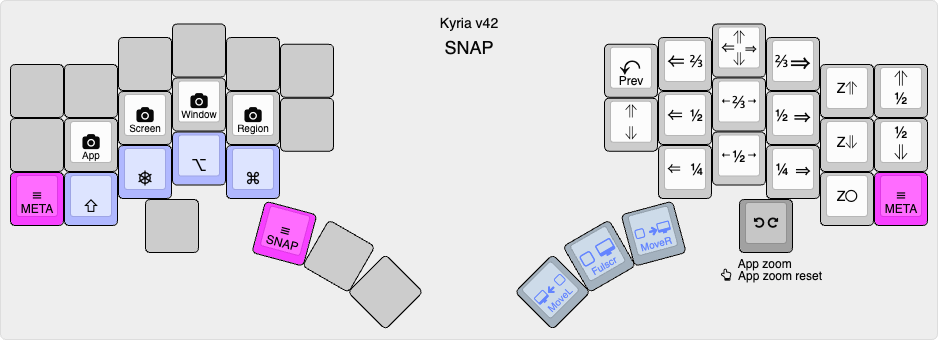

# Kyria RSTHD/Prime v35

This is the keymap for my Kyria keyboard from [splitkb.com](https://splitkb.com). The alpha layout was based on [RSTHD](https://xsznix.wordpress.com/2016/05/16/introducing-the-rsthd-layout/) but is now heavily modified. It's optimized for minimized usage of the inner index column. Features in the code include runtime switching between Mac/Windows/Linux shortcuts and a custom implementation of "comborolls".

<!--ts-->
   * [Overview](#overview)
      * [Goals](#goals)
      * [Keyboard configuration](#keyboard-configuration)
      * [Features](#features)
         * [Platform-independent shortcuts](#platform-independent-shortcuts)
         * [Comborolls](#comborolls)
         * [Custom shift keys](#custom-shift-keys)
         * [Custom edit modifiers](#custom-edit-modifiers)
         * [Custom layer switching](#custom-layer-switching)
   * [Alpha layer](#alpha-layer)
   * [Other layers](#other-layers)
      * [SYMS](#syms)
      * [EDIT](#edit)
      * [META](#meta)
      * [FUNC](#func)
      * [SNAP](#snap)
   * [Backmatter](#backmatter)
      * [How to build](#how-to-build)
      * [RSTHD variants and similar layouts](#rsthd-variants-and-similar-layouts)
      * [Relevant articles and resources](#relevant-articles-and-resources)
      * [Acknowledgments](#acknowledgments)

<!--te-->

## Overview

The alphabetic layout in this keymap was originally based on [RSTHD](https://xsznix.wordpress.com/2016/05/16/introducing-the-rsthd-layout/). I tried it, liked it, tweaked it, and tweaked some more...

When I originally started making changes to RSTHD, I called it RSTHD'. The `'`, pronounced "prime", is [used in maths](https://en.wikipedia.org/wiki/Prime_(symbol)#Use_in_mathematics,_statistics,_and_science) to indicate a derivative of the named thing. The layout still very much retains its RSTHD DNA despite all the changes. I figure calling it *RSTHD/Prime* acknowledges its origin while still indicating that it's different.

Currently, this compiles for and works on the rev1 and rev3 versions of the Kyria. There are some lines at the top of rules.mk that will need to be un/commented accordingly.

**As of late 2023, I'm not maintaining this documentation any more. It's too much work to be frank. It serves as a general guide, but for actual info please refer to the source. The best starting point is a level up: [frogmouth keyboard firmware](../). For example, the keymap.c file for each keyboard's layout.**

### Goals

Coming from a "slab" QWERTY keyboard to a programmable ergo split, I wanted to optimize:

- Comfort. For me, that largely means de-emphasizing the inner index column. I've gone as far as to remove the lower key on that column (qwerty B/N). It also means balancing hand usage better.
- Cross-platform portability. I need to switch between macOS and Windows frequently. The differences in shortcuts and location of Ctrl/Cmd keys was frustrating and programmable keyboards seemed to be the answer.
- Better support for ambidextrous use of the trackpad or mouses (I use two). For example, it should be possible to do things like cut-copy-paste from either hand alone.

Typing speed and reducing the number of keys on the keyboard are not important goals to me. With that said, my layout has now shrunk to 40 keys.

### Keyboard configuration

My Kyria uses all 6 columns on each hand. However, the lower inner column keys are absent. There are three thumb keys on each side. The left side has an OLED and an encoder, while the right side has neither.

The controller is a Pro Micro with 32kB flash. Currently this keymap might compile or work properly only on a v1 keyboard.

### Features

See [common code](../common/README.md).

#### Platform-independent shortcuts

A set of shortcuts which can be switched at run-time for macOS, Windows, or Linux. macOS shortcuts are pretty stable, Windows and Linux still need work. For more info, see `os_shortcuts.h/c` and `os_shortcut_defs.h`.

#### Comborolls

I have a userspace implementation of combos called "[comboroll](docs/comborolls.md)" to avoid timing issues with QMK's overlapping combos. See `combo_defs.h` for combo definitions and `comboroll.h/c` for the implementation.

#### Custom shift keys

I generalized the notion of having a non-standard character output on shift so that any unshifted/shifted pair can be defined with a macro. See `shift_defs.h` for definitions and `keymap.c` for the implementation.

#### Custom edit modifiers

This is platform independent shortcuts taken to the max. I can never reliably remember which modifiers do what to the arrow keys on which platform so I've defined a set of custom modifiers. See the EDIT layer below and `custom_edit.h/c` for the implementation.

#### Custom layer switching

Layer switching is done with custom code, so that a. shifted and custom keys can be emitted on the tap and b. so that the layer activates immediately for faster access to the keys in the layer. See `layer_tap_toggle.c/h`.

## Alpha layer


[KLE link](http://www.keyboard-layout-editor.com/#/gists/a48554fccaea2a2266e58876b8b8f142)

The alpha layout aims to reduce lateral finger movement on the index finger. In fact the lower key of the inner column has been completely removed in this version. A slightly older version performed very well in an [analyzer](docs/prime-on-the-analyzer.md), with low SFU (same finger utilization) stats and low travel distance. For absolute minimum SFBs, swap P and F.  For lower left pinky usage (but higher inner index), swap V and J.

Except for Shift, there are no modifiers on the alpha layer. To access them, use the SYMS or EDIT layer, hold the modifiers down, then release the layer key. (This is a bit like Callum mods except it doesn't use one-shots.)

This layout works best with [comborolls](docs/comborolls.md). I recommend at a minimum setting up a combo for ER on the right hand. If that works out, add SP, ES, ED, and VE, then consider the rest of the comborolls at the link.

## Other layers

There are five more layers, for a total of 6. They are activated with either a thumb or pinky. All are hold-to-activate but the layer can be locked on with the top corner keys. Press one of these or the layer key to turn the layer off.

### SYMS

Activated by the left thumb.



[KLE link](http://www.keyboard-layout-editor.com/#/gists/0cda56d56e7e269cce643fd397d6f518)

Unshifted, this layer contains the rest of the punctuation characters. I've arranged them so that many common (for me) two-letter sequences can be typed with an inward roll. For example: ` <% %> </ /> => -> ~/`. Additional sequences such as `<?` `?>`  `!=` `);` are accessed with comborolls, to avoid flipping between the alpha and syms layers.

The ten digits are accessed with Shift, akin to [Programmer Dvorak](https://www.kaufmann.no/roland/dvorak/), but arranged in a 3x3 numpad-like grid.

Cut, copy and paste are chorded on the left hand top row.


### EDIT

Activated by the right thumb.


[KLE link](http://www.keyboard-layout-editor.com/#/gists/da3a42f92f10874a56e664c1ea154b02)

This layer extends the idea of platform-independent shortcuts to a complete layer. The navigation keys on the left have the standard cursor keys, home, end and page up/down.

Modifiers are on the right hand. If one of the standard modifiers (Shift, Ctrl, Alt, Gui) is held, the emitted code is just the normal modifier + keycode. The special modifiers on the home row act as follows:

- **Delete** makes the action delete instead of moving.
- **More** makes the key do "more" : left and right move a word left or right; home and end move to the start and end of a paragraph; page up/down move to the start and end of the document. Up and down are an exception: these activate mouse wheel scrolling.
- **X4** makes the action repeat 4 times on every keypress or repeat.
- **Fast** removes the initial repeat delay and repeats at a faster interval.

All actions have auto-repeat. You can change the special modifiers while holding down a navigation key and the action changes accordingly.

Cut, copy and paste are chorded on the right hand top row. There are various shortcut keys for desktop navigation scattered around the edges.

### META
Activated by either pinky.


[KLE link](http://www.keyboard-layout-editor.com/#/gists/215ec7e4fabd3d619b2a7937bb030b63)

This layer contains common shortcut keys. They are mostly arranged according to the letter used in the Mac/Windows shortcut. For example, the S key invokes Save (Cmd-S on Mac, Ctrl-S on Windows). However, the mapping is not always that straightforward (e.g. Cmd-Q on Mac and Alt-F4 on Windows), hence the need for a dedicated layer.

This layer is also how the FUNC and SNAP layers are accessed.


### FUNC

Activated by the left thumb from the META layer.


[KLE link](http://www.keyboard-layout-editor.com/#/gists/53ebdf360cfd77b3e7bcdceae14dc78d)

This layer contains function keys on the right hand, arranged roughly the same as the numpad. It also contains the keys that switch between macOS, Windows and Linux shortcuts.

Three mouse buttons are available on the right thumb.

### SNAP

Activated by the right thumb from the META layer.



[KLE link](http://www.keyboard-layout-editor.com/#/gists/fbecdc0202bbec91e8943985a22800ce)

So called because of the keys for window snapping, which snap to one of the screen halves or quadrants. The center key sets the window to the full vertical height. This works on macOS if [Rectangle](https://rectangleapp.com) is running; not really working on Windows and Linux yet.

Three mouse buttons are available on the left thumb. On the right are shortcuts for screenshots.

The encoder is used to control the backlight LEDs and OLED brightness, depending on which modifier is held.


## Backmatter

### How to build

If you'd like to try the keymap out, here's one way:

```
cd /path/to/workingdir
git clone https://github.com/frogm0uth/keyboard-firmware.git
```

Assuming you already have QMK set up using the documented method:

```
cd ~qmk_firmware/keyboards/splitkb/kyria/keymaps
ln -s /path/to/workingdir/keyboard-firmware/kyria-rsthd-prime .
qmk compile -kb splitkb/kyria/rev1 -km kyria-rsthd-prime
```
 or for rev3, change the last line to:
```
qmk compile -kb splitkb/kyria/rev3 -km kyria-rsthd-prime
```

### RSTHD variants and similar layouts
- [T-34](https://www.jonashietala.se/blog/2021/06/03/the-t-34-keyboard-layout/) (swaps E and space)
- [New layout for lateral movement haters](https://www.reddit.com/r/KeyboardLayouts/comments/mnumbs/new_layout_for_lateral_movement_haters/) (Some similarities to this layout)
- [RSTHD today](https://xsznix.wordpress.com/2021/01/13/rsthd-today/) (Latest layout generated by keygen with revised scoring and different corpus)
- [andrewjrae/kyria-keymap](https://github.com/andrewjrae/kyria-keymap) (Swaps E and Space)
- [johnm/keymap.c](https://gist.github.com/johnm/e3c129b20bbcae97601e547a7dd9fa0a) (Mirrors the complete alpha block, and some other tweaks)
- [minidox RSTHD](https://github.com/qmk/qmk_firmware/tree/master/keyboards/maple_computing/minidox/keymaps/rsthd_combos) (Port of RSTHD to the MiniDox keyboard)

### Relevant articles and resources

- [Pressing E with the thumb‽](https://precondition.github.io/pressing-e-with-the-thumb) (Nice survey article of layouts with letters on a thumb key)
- [keymapDB](https://keymapdb.com) (Searchable site with summaries of a lot of neat keymaps)

### Acknowledgments

Table of contents created by [gh-md-toc](https://github.com/ekalinin/github-markdown-toc). To update, run

```
/path/to/gh-md-toc --insert README.md
```

Much inspiration came from the residents of the [splitkb discord server](https://splitkb.com/discord).

Thanks to the author of [RSTHD](https://xsznix.wordpress.com/2016/05/16/introducing-the-rsthd-layout/) for the great layout.

[QMK](https://qmk.fm) rocks!

