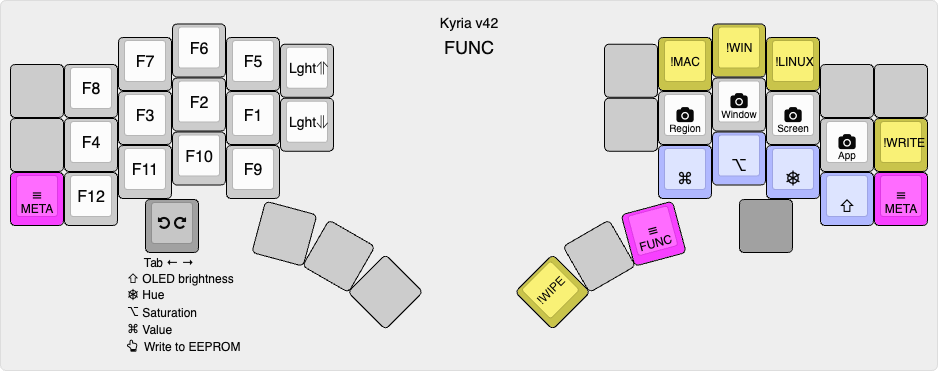

# Kyria RSTHD/Prime v39

This is the keymap for my Kyria keyboard from [splitkb.com](https://splitkb.com). The alpha layout was based on [RSTHD](https://xsznix.wordpress.com/2016/05/16/introducing-the-rsthd-layout/) but is now heavily modified. The layout is optimized for minimum usage of the inner index column. Features in the code include runtime switching between Mac/Windows/Linux shortcuts and a custom implementation of "comborolls".

<!--ts-->
   * [Overview](#overview)
      * [Latest changes](#latest-changes)
      * [Goals](#goals)
      * [Keyboard configuration](#keyboard-configuration)
      * [Features](#features)
         * [Platform-independent shortcuts](#platform-independent-shortcuts)
         * [Comborolls](#comborolls)
         * [Custom shift keys](#custom-shift-keys)
         * [Custom edit modifiers](#custom-edit-modifiers)
         * [Custom layer switching](#custom-layer-switching)
   * [Alpha layer](#alpha-layer)
   * [Other layers](#other-layers)
      * [SYMS](#syms)
      * [EDIT](#edit)
      * [META](#meta)
      * [FUNC](#func)
      * [SNAP](#snap)
   * [Backmatter](#backmatter)
      * [How to build](#how-to-build)
      * [RSTHD variants and similar layouts](#rsthd-variants-and-similar-layouts)
      * [Relevant articles and resources](#relevant-articles-and-resources)
      * [Acknowledgments](#acknowledgments)

<!--te-->

## Overview

The alphabetic layout in this keymap was *originally* based on [RSTHD](https://xsznix.wordpress.com/2016/05/16/introducing-the-rsthd-layout/). I tried it, liked it, tweaked it, and tweaked some more...

When I originally started making changes to RSTHD, I called it RSTHD'. The `'`, pronounced "prime", is [used in maths](https://en.wikipedia.org/wiki/Prime_(symbol)#Use_in_mathematics,_statistics,_and_science) to indicate a derivative of the named thing. While the layout is hardly  recognizable as RSTHD any more, I still call it *RSTHD/Prime* to acknowledge its origin.

The code is known to compile for and work on a rev1 Kyria with a 32kB Pro Micro controller and a rev3 Kyria with a Liatris controller. There are some lines at the top of rules.mk that will need to be un/commented accordingly.

See also [Kyria Build Notes](docs/kyria-build-notes.md).

### Latest changes

April 2024/v39: I think this layout is finally "it." Here are the changes that have put the icing on my little keyboard cake:

- R and D swap positions
- `-` and `'` swap positions
- M and F swap hands
- E and space swap hands
- SYMS layer uses a numrow (instead of numpad)

**As of late 2023, I don't keep the documentation rigorously updated. It's too much work to be frank. For current status please refer to the source. See also the [common](../common/) folder.**

### Goals

Coming from a "slab" QWERTY keyboard to a programmable ergo split, I wanted to optimize:

- Comfort. For me, that largely means de-emphasizing the inner index column. I've gone as far as to remove the lower key on that column (qwerty B/N). It also means balancing hand usage better.
- Cross-platform portability. I need to switch between macOS and Windows frequently. The differences in shortcuts and location of Ctrl/Cmd keys was frustrating and programmable keyboards seemed to be the answer.
- Better support for ambidextrous use of the trackpad or mouses (I use two). For example, it should be possible to do things like cut-copy-paste from either hand alone.

Typing speed and reducing the number of keys on the keyboard are not important goals to me. With that said, my layout has now shrunk to 40 keys.

### Keyboard configuration

My Kyria uses all 6 columns on each hand. However, the lower inner column keys are absent. There are three thumb keys on each side. The left side has an OLED.

Either side can take an encoder. The screenshots and description below mostly assume it is on the left, but a right-side encoder works, and would usually be used with the "opposite" layer (EDIT instead of SYMS, SNAP instead of FUNC). In practice, I find that I mostly use the encoder for adjusting keyboard lighting, as for most functions it's quicker to just use keys; I could certainly live without it.

### Features

See [common code](../common/README.md).

#### Platform-independent shortcuts

A set of shortcuts which can be switched at run-time for macOS, Windows, or Linux. macOS shortcuts are pretty stable, Windows and Linux still need work. For more info, see `os_shortcuts.h/c` and `os_shortcut_defs.h`.

#### Comborolls

I have a userspace implementation of combos called "[comboroll](docs/comborolls.md)" to avoid timing issues with QMK's overlapping combos. The doc is out of date for the current key layout, but see `combo_defs.h` for combo definitions and `comboroll.h/c` for the implementation.

#### Custom shift keys

I generalized the notion of having a non-standard character output on shift so that any unshifted/shifted pair can be defined with a macro. See `shift_defs.h` for definitions and `process.c` for the implementation.

#### Custom edit modifiers

This is platform independent shortcuts taken to the max. I can never reliably remember which modifiers do what to the arrow keys on which platform so I've defined a set of custom modifiers. See the EDIT layer below and `custom_edit.h/c` for the implementation.

#### Custom layer switching

Layer switching is done with custom code, so that a. shifted and custom keys can be emitted on the tap and b. so that the layer activates immediately for faster access to the keys in the layer. See `layer_tap_toggle.c/h`.

## Alpha layer


[KLE link](http://www.keyboard-layout-editor.com/#/gists/35bf08ea0f5aec96e33b1234b7dc3d5a)

The alpha layout aims to reduce lateral finger movement on the index finger. In fact, the lower keys of the inner columns have now been removed entirely.

An older version of the layout performed very well in an [analyzer](docs/prime-on-the-analyzer.md), with low SFU (same finger utilization) stats and low travel distance. Since then, changes have been made to the layout that nominally give it worse performance, because of the use of [comborolls](docs/comborolls.md).

*Effective use of this layout **requires** comborolls.* For a layout that doesn't (so much), see [Kyria v38](https://github.com/frogm0uth/keyboard-firmware/tree/kyria-v38/kyria-rsthd-prime). 

These characters can only be accessed with comborolls: J, K and backslash.

The shift keys are "auto-off":
- If a shift key is held and another key is pressed, you get the shifted version of the key then shift is turned off. This completely eliminates typos like "THe".
- If a shift key is tapped, it toggles caps-word.
- If both shift keys are tapped at the same, they toggle caps-lock.

Except for Shift, there are no modifiers on the alpha layer. To access them, hold the SYMS or EDIT layer key, hold the modifier(s) down, then release the layer key. This is a bit like Callum mods except it doesn't use one-shots. This is less inconvenient than it sounds: you can usually roll the layer key with the modifier, and common shortcuts have dedicated keys on other layers anyway.

Since v37, E and Space have swapped hands relative to their RSTHD positions. This seems to be common amongst adopters - see [RSTHD variants and similar layouts](#rsthd-variants-and-similar-layouts). F and M also swapped hands to reduce pinballing off the right index column; while partially effective, I still find it helpful to have F as a comboroll on the left hand to break up words like LIFE.

Since v39, R and D have swapped locations compared to RSTHD. Having R on the index finger gives a lot of inward rolls, but also creates a lot of SFBs on that finger. I've addressed this with comborolls; even so, there are about the same number as the previous version.

The encoder is used to adjust volume and screen brightness.

## Other layers

There are five more layers, for a total of 6. All are hold-to-activate. The shift keys in these layers are *not* auto-off. In v38, the "handedness" of most of these layers was reversed i.e. they were mostly mirror-imaged. 

### SYMS

Activated by the right thumb.


[KLE link](http://www.keyboard-layout-editor.com/#/gists/28a80ba78a02f052b21f8f9e520dcbb2)

Numbers and punctuation are combined on one layer. Numbers are along the home row and punctuation is mostly arranged on the left hand. (If only one character shown, it is output regardless of Shift.)

The punctuation is arranged so that common (for me) symbol bigrams are an inward roll: ` </ /> ~/ -> ()`. The `=` symbol is on the right hand because it combines with so many other symbols. Additional bigrams such as `/* */ => );` are on comborolls that activate if shift is held. Overall, this layer works much better for me than pre-v38 versions that used a numpad layout.

Cut, copy and paste shortcuts are along the right hand top row.

The encoder is used for history scrubbing.

### EDIT

Activated by the left thumb.


[KLE link](http://www.keyboard-layout-editor.com/#/gists/34224a80a381a5350f2e8841d8d23ab5)

This layer extends the idea of platform-independent shortcuts to a complete layer. The right hand has the standard cursor keys, home/end and page up/down.

Modifiers are on the left hand. If one of the standard modifiers (Shift, Ctrl, Alt, Gui) is held, the emitted code is that modifier + keycode. The special modifiers on the home row act as follows:

- **Delete** makes the action delete instead of moving.
- **More** makes the key do "more" : left and right move a word left or right; home and end move to the start and end of a paragraph; page up/down move to the start and end of the document. Up and down are an exception: these activate mouse wheel scrolling.
- **X4** makes the action repeat 4 times on every keypress or repeat.
- **Fast** removes the initial repeat delay and repeats at a faster interval.

All actions have auto-repeat. You can change the special modifiers while holding down a navigation key and the action changes accordingly.

Cut, copy and paste shortcuts are along the left hand top row. Shortcuts for window and desktop navigation are scattered around the edges.

If there is an encoder on the right side, holding one of the custom modifiers and rotating the encoder does "fast editing". (In practice though, I never use this.)

### META
Activated by either pinky.


[KLE link](http://www.keyboard-layout-editor.com/#/gists/6df4436f4d7d0af194867ecd1bb84b75)

This layer contains common shortcuts, mostly arranged according to the letter used in the Mac/Windows shortcut. For example, the S key invokes Save (Cmd-S on Mac, Ctrl-S on Windows). However, the mapping is not always that straightforward (e.g. Cmd-Q on Mac and Alt-F4 on Windows), hence the use of a dedicated layer.

This layer also contains media control keys and the keys to access the FUNC and SNAP layers.

The encoder is used for forward and backward search.

### FUNC

Activated by the right thumb from the META layer.



[KLE link](http://www.keyboard-layout-editor.com/#/gists/d92e0106ea3488121c06071fa5cf543a)

This layer contains function keys on the left hand and mouse buttons on the left thumb. It also contains the keys that switch between macOS, Windows and Linux shortcuts.

The encoder is used to adjust the OLED brightness and the backlight/per-key LEDs, depending on which modifier is held. There are also two keys on the left hand for this, in case there is no encoder.

### SNAP

Activated by the left thumb from the META layer.


[KLE link](http://www.keyboard-layout-editor.com/#/gists/9384b760732a7f55a02fbe9f45dd58e4)

So called because of the keys for window snapping, which snap the active window to various locations on the screen. This works on macOS if [Rectangle Pro](https://rectangleapp.com) is running; it is not working at all on Windows and Linux yet.

It also contains shortcuts for screenshots and for window zooming, as well as mouse buttons.

## Backmatter

### How to build

If you'd like to try the keymap out, here's one way:
```
cd /path/to/workingdir
git clone https://github.com/frogm0uth/keyboard-firmware.git
```
Assuming you already have QMK set up using the documented method:
```
cd ~qmk_firmware/keyboards/splitkb/kyria/keymaps
ln -s /path/to/workingdir/keyboard-firmware/kyria-rsthd-prime .
```
To compile for a rev1 board with a Pro Micro controller:
```
qmk compile -kb splitkb/kyria/rev1 -km kyria-rsthd-prime
```
To compile for a rev3 board with a Liatris controller:
```
qmk compile -e CONVERT_TO=liatris -kb splitkb/kyria/rev3 -km kyria-rsthd-prime
```

### RSTHD variants and similar layouts
- [RSTHD today](https://xsznix.wordpress.com/2021/01/13/rsthd-today/) (Latest layout generated by keygen with revised scoring and different corpus)
- [New layout for lateral movement haters](https://www.reddit.com/r/KeyboardLayouts/comments/mnumbs/new_layout_for_lateral_movement_haters/) (Some similarities to this layout)
- [T-34](https://www.jonashietala.se/blog/2021/06/03/the-t-34-keyboard-layout/) (Based on RSTHD, swaps E and space)
- [andrewjrae/kyria-keymap](https://github.com/andrewjrae/kyria-keymap) (Based on RSTHD, swaps E and space)
- [johnm/keymap.c](https://gist.github.com/johnm/e3c129b20bbcae97601e547a7dd9fa0a) (Based on RSTHD, mirrors the complete alpha block but not the thumbs)

### Relevant articles and resources

- [Pressing E with the thumb‽](https://precondition.github.io/pressing-e-with-the-thumb) (Nice survey article of layouts with letters on a thumb key)
- [keymapDB](https://keymapdb.com) (Searchable site with summaries of a lot of neat keymaps)

### Acknowledgments

Table of contents created by [gh-md-toc](https://github.com/ekalinin/github-markdown-toc). To update, run
```
/path/to/gh-md-toc --insert README.md
```
Much inspiration came from the residents of the [splitkb discord server](https://splitkb.com/discord).

Thanks to the author of [RSTHD](https://xsznix.wordpress.com/2016/05/16/introducing-the-rsthd-layout/) for the great layout.

[QMK](https://qmk.fm) rocks!

