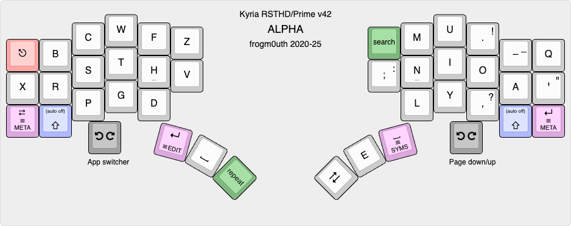
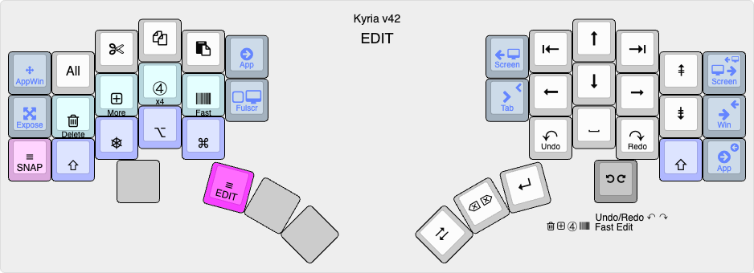
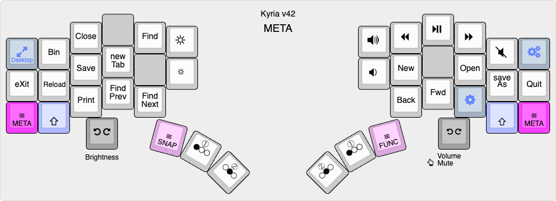

# Kyria RSTHD/Prime v41

This is the keymap for my Kyria keyboard from [splitkb.com](https://splitkb.com). The alpha layout was based on [RSTHD](https://xsznix.wordpress.com/2016/05/16/introducing-the-rsthd-layout/) but is now heavily modified. The layout is optimized for minimum usage of the inner index column. Features in the code include runtime switching between Mac/Windows/Linux shortcuts and a custom implementation of *comborolls*.

<!--ts-->
   * [Overview](#overview)
      * [Latest changes](#latest-changes)
      * [Goals](#goals)
      * [Keyboard configuration](#keyboard-configuration)
      * [Features](#features)
   * [Alpha layer](#alpha-layer)
   * [Other layers](#other-layers)
      * [SYMS](#syms)
      * [EDIT](#edit)
      * [META](#meta)
      * [FUNC](#func)
      * [SNAP](#snap)
   * [Layout notes](#layout-notes)
      * [Why put E on the thumb?](#why-put-e-on-the-thumb)
      * [E on which thumb?](#e-on-which-thumb)
      * [Comboroll what?](#comboroll-what)
   * [Backmatter](#backmatter)
      * [How to build](#how-to-build)
      * [RSTHD variants and similar layouts](#rsthd-variants-and-similar-layouts)
      * [Relevant articles and resources](#relevant-articles-and-resources)
      * [Acknowledgments](#acknowledgments)

<!--te-->

## Overview

The alphabetic layout in this keymap was *originally* based on [RSTHD](https://xsznix.wordpress.com/2016/05/16/introducing-the-rsthd-layout/). I tried it, liked it, tweaked it, and tweaked some more...

When I originally started making changes to RSTHD, I called it RSTHD'. The `'`, pronounced "prime", is [used in maths](https://en.wikipedia.org/wiki/Prime_(symbol)#Use_in_mathematics,_statistics,_and_science) to indicate a derivative of the named thing. While the layout has now diverged a lot from RSTHD, I still call it *RSTHD/Prime* to acknowledge its origin while making it clear that it's not the same.

The code is known to compile for and work on a rev1 Kyria with a 32kB Pro Micro controller and a rev3 Kyria with a Liatris controller. There are some lines at the top of rules.mk that will need to be un/commented accordingly.

See also [Kyria Build Notes](docs/kyria-build-notes.md).

### Goals

Coming from a "slab" QWERTY keyboard to a programmable ergo split, I wanted to optimize:

- Comfort. For me, that largely means de-emphasizing the inner index columns. I've gone as far as to remove the lower key on those columns.
- Cross-platform portability. The differences in shortcuts and location of Ctrl/Cmd keys on macOS and Windows are frustrating and programmable keyboards seemed to be the answer.
- Better support for ambidextrous use of the trackpad. For example, it should be possible to do things like cut-copy-paste from either hand alone.

Typing speed and reducing the number of keys on the keyboard are not important goals to me. With that said, my layout has now shrunk to 40 keys.

### Keyboard configuration

My Kyria uses all 6 columns on each hand. However, the lower inner column keys are absent. There are three thumb keys on each side. The left side has an OLED and an encoder. In practice, I find that I mostly use the encoder for adjusting keyboard lighting, as for other functions it's quicker to just use keys.

### Features

See [common code](../common/README.md).

## Alpha layer



[KLE link](http://www.keyboard-layout-editor.com/#/gists/06f63ae2174923cb64fc7dbdb55b841b)

The alpha layout aims to reduce lateral finger movement on the index finger.

An older version of the layout performed very well in an [analyzer](docs/prime-on-the-analyzer.md), with low SFU (same finger utilization) stats and low travel distance. Since then, some changes have been made to the layout that nominally give it worse performance, because of the use of [comborolls](#comboroll-what).

*Use of this layout **requires** comborolls.*

Some letters can only be accessed with comborolls: J, K and `\`. Some are usually accessed with comborolls even though they have a key: B and V. The letter M has a comboroll on the left hand to counter pin-balling off the MNL column.

The shift keys are "auto-off":
- If a shift key is held and another key is pressed, you get the shifted version of the key then shift is turned off. This completely eliminates typos like "THe".
- If a shift key is tapped, it toggles caps-word.
- If both shift keys are tapped at the same, they toggle caps-lock.

Except for Shift, there are no modifiers on the alpha layer. To access them, hold the SYMS or EDIT layer key, hold the modifier(s) down, then release the layer key. This is a bit like Callum mods except it doesn't use one-shots.

The "repeat" thumb key is different to other implementations, in that you press it *before* the key that is to be repeated. This makes it possible to place it on the same thumb as space, as double letters often occur at the end of words.

Since v37, E and Space have swapped hands relative to their RSTHD positions. This seems to be common amongst adopters - see [RSTHD variants and similar layouts](#rsthd-variants-and-similar-layouts).

The encoder is used to adjust volume and screen brightness.

## Other layers

There are five more layers, for a total of 6. All are hold-to-activate. The shift keys in these layers are *not* auto-off.

### SYMS

Activated by the right thumb.


[KLE link](http://www.keyboard-layout-editor.com/#/gists/098aba74e9c04713110edcf25372559d)

Numbers and punctuation are combined on one layer. Numbers are along the home row and punctuation is mostly arranged on the left hand. (If only one character shown, it is output regardless of Shift.)

The punctuation is arranged so that common (for me) symbol bigrams are an inward roll: ` </ /> ~/ -> ()`. The `=` symbol is on the right hand because it combines with so many other symbols. Additional bigrams such as `/* */ => );` are on comborolls that activate if shift is held. Overall, this layer works much better for me than earlier versions that used a numpad layout.

Cut, copy and paste shortcuts are along the right hand top row.

The encoder is used for history scrubbing.

### EDIT

Activated by the left thumb.



[KLE link](http://www.keyboard-layout-editor.com/#/gists/cf3687727512c49fd8baccf7459a6ddb)

This layer extends the idea of platform-independent shortcuts to a complete layer. The right hand has the standard cursor keys, home/end and page up/down.

Modifiers are on the left hand. If one of the standard modifiers (Shift, Ctrl, Alt, Gui) is held, the emitted code is that modifier + keycode. The special modifiers on the home row act as follows:

- **Delete** makes the action delete instead of moving.
- **More** makes the key do "more" : left and right move a word left or right; home and end move to the start and end of a paragraph; page up/down move to the start and end of the document. Up and down are an exception: these activate mouse wheel scrolling.
- **X4** makes the action repeat 4 times on every keypress or repeat.
- **Fast** removes the initial repeat delay and repeats at a faster interval.

All actions have auto-repeat. You can change the special modifiers while holding down a navigation key and the action changes accordingly.

Cut, copy and paste shortcuts are along the left hand top row. Shortcuts for window and desktop navigation are scattered around the edges.

### META
Activated by either pinky.



[KLE link](http://www.keyboard-layout-editor.com/#/gists/6629f8673758273154b55ee8da43293c)

This layer contains common shortcuts, mostly arranged according to the letter used in the Mac/Windows shortcut. For example, the S key invokes Save (Cmd-S on Mac, Ctrl-S on Windows). However, the mapping is not always that straightforward (e.g. Cmd-Q on Mac and Alt-F4 on Windows), hence the use of a dedicated layer.

This layer also contains media control keys and the keys to access the FUNC and SNAP layers.

The encoder is used for forward and backward search.

### FUNC


Activated by the right thumb from the META layer.


[KLE link](http://www.keyboard-layout-editor.com/#/gists/910a80c762c4e1a844969cdb8b0ff876)

This layer contains function keys on the left hand and mouse buttons on the left thumb. It also contains the keys that switch between macOS, Windows and Linux shortcuts. Keys for screenshots are duplicated from the SNAP layer.

The encoder zooms the current application. If a modifier is held, it adjusts the OLED brightness and the backlight/per-key LEDs, depending on the modifier. There are also two keys on the left hand for this, in case there is no encoder.

### SNAP

Activated by the left thumb from the META layer.


[KLE link](http://www.keyboard-layout-editor.com/#/gists/e63007b231cb9a8d2fb4366b60a1ec57)

So called because of the keys for window snapping, which snap the active window to various locations on the screen. This works on macOS if [Rectangle Pro](https://rectangleapp.com) is running; it is not working at all on Windows and Linux yet.

It also contains shortcuts for screenshots and for window zooming, as well as mouse buttons.


## Layout notes

### Why put E on the thumb?

Opinions differ about whether E is a good letter to put on a thumb key, or whether putting a letter on the thumb is a good idea at all.

To be frank, some of the arguments put forth about this seem a little bizarre to me. Ultimately, of course, everyone should use what they find comfortable, but the *reason* to use E is simply that (in English) it's the most common letter by far, so putting it on a thumb provides greater freedom to redistribute the load on the fingers.

In my case, it has meant I can remove most of the load on the inner index column. Other people might have an issue with pinkies. Thing is, every layout choice has compromises and you need to pick the set that is most comfortable to you. If I had spider fingers and could use every column fully, for example, perhaps I would use a layout with E in the alpha block instead. (Then again, perhaps I wouldn't need an ergonomic keyboard at all.)

### E on which thumb?

RSTHD has E on the left thumb, but many adopters swap the E and space, as indicated in [RSTHD variants and similar layouts](#rsthd-variants-and-similar-layouts) below. I have tried both, starting with E on the left thumb a la RSTHD (now the [kyria-v42](https://github.com/frogm0uth/keyboard-firmware/blob/kyria-v42/kyria-rsthd-prime/README.md) branch) and, later on, E on the right thumb (the [kyria-v41](https://github.com/frogm0uth/keyboard-firmware/blob/kyria-v41/kyria-rsthd-prime/README.md) branch).

The swapped-E version seems appealing at first, and rollers such as myself will enjoy rolling off the consonants onto the space. However, I found that, as I gained fluency, I would just stumble sometimes. Eventually, I realized why: "pinballing" between the space and the consonants. Consider a phrase such as "with this ring that" - between every pair of words there is a redirect/pinball on the thumb i.e.  `t t`, `s r`, `g t`.

This was an interesting realization, and led me to try the left-thumb E again. Well, every layout has compromises and in the end I decided to stay with the swapped-E version. I have counteracted the pinballing mentioned somewhat by adding a comboroll for space on the right hand. I've also got a comboroll for E-space on the right hand to reduce alternation (when E occurs at the end of a word, which is often).

### Comboroll what?

I wrote a long explanation of these a while back, but my thinking has evolved since then, so here's a short version. Basically, a comboroll is a combo that you trigger by rolling two letters - that is, press the second key before releasing the first. Usually, the trigger keys are an inward roll. The number of output letters ranges from one to four - I haven't found longer to be useful.

That's it. Not complicated. While I have a custom implementation, you can do a version of it in QMK with the `COMBO_MUST_PRESS_IN_ORDER` or `COMBO_MUST_PRESS_IN_ORDER_PER_COMBO` flags ([docs](https://docs.qmk.fm/features/combo#advanced-configuration)). The QMK implementation has some limitations (\*), but it's certainly good enough to get a feel for the concept.

Essentially, a comboroll changes something "bad" into something "good" (a roll). The "bad" thing could be an SFB, a redirect, a too-long sequence of alternations, or some other awkward key sequence.

Because the combo is "directional", you can use trigger keys that you might not want to use for a normal combo. For example, OA is somewhat common but AO is uncommon, so you can use AO as a comboroll trigger. For this reason, you can also have a longer timeout. When you get it right, and assuming you roll keys when you type anyway, the comboroll fits into the normal flow of typing but changes the key patterns into something more comfortable.

The old long version of the essay is [here](docs/comborolls.md).

(\*) The QMK implementation may give unexpected results with overlapping combos. For example, if AB produces X and AC produces Y, then rolling ABC will produce BY. In addition, if shift is pressed, all output letters are shifted (there is no way to have just the first letter capitalized).


## Backmatter

### How to build

If you'd like to try the keymap out, here's one way:
```
cd /path/to/workingdir
git clone https://github.com/frogm0uth/keyboard-firmware.git
```
Assuming you already have QMK set up using the documented method:
```
cd ~/qmk_firmware/keyboards/splitkb/kyria/keymaps
ln -s /path/to/workingdir/keyboard-firmware/kyria-rsthd-prime .
```
To compile for a rev1 board with a Pro Micro controller:
```
qmk compile -kb splitkb/kyria/rev1 -km kyria-rsthd-prime
```
To compile for a rev3 board with a Liatris controller, you will also need to symlink the customized info.json file which turns off the unused LEDs:
```
cd ~/qmk_firmware/keyboards/splitkb/kyria
mv rev3 x-rev3
ln -s /path/to/workingdir/keyboard-firmware/kyria-rsthd-prime/kyria/rev3 .
```
(There must be a better way to do this than modifying the keyboard/hardware definition, but I couldn't figure it out.)

Then:
```
qmk compile -e CONVERT_TO=liatris -kb splitkb/kyria/rev3 -km kyria-rsthd-prime
```

### RSTHD variants and similar layouts
- [RSTHD today](https://xsznix.wordpress.com/2021/01/13/rsthd-today/) (Latest layout generated by keygen with revised scoring and different corpus)
- [New layout for lateral movement haters](https://www.reddit.com/r/KeyboardLayouts/comments/mnumbs/new_layout_for_lateral_movement_haters/) (Some similarities to this layout)
- [T-34](https://www.jonashietala.se/blog/2021/06/03/the-t-34-keyboard-layout/) (Based on RSTHD, swaps E and space)
- [andrewjrae/kyria-keymap](https://github.com/andrewjrae/kyria-keymap) (Based on RSTHD, swaps E and space)
- [johnm/keymap.c](https://gist.github.com/johnm/e3c129b20bbcae97601e547a7dd9fa0a) (Based on RSTHD, mirrors the complete alpha block but not the thumbs)

### Relevant articles and resources

- [Pressing E with the thumb‽](https://precondition.github.io/pressing-e-with-the-thumb) (Nice survey article of layouts with letters on a thumb key)
- [keymapDB](https://keymapdb.com) (Searchable site with summaries of a lot of neat keymaps)

### Acknowledgments

Table of contents created by [gh-md-toc](https://github.com/ekalinin/github-markdown-toc). To update, run
```
/path/to/gh-md-toc --insert README.md
```
Much inspiration came from the residents of the [splitkb discord server](https://splitkb.com/discord).

Thanks to the author of [RSTHD](https://xsznix.wordpress.com/2016/05/16/introducing-the-rsthd-layout/) for the great layout.

[QMK](https://qmk.fm) rocks!

