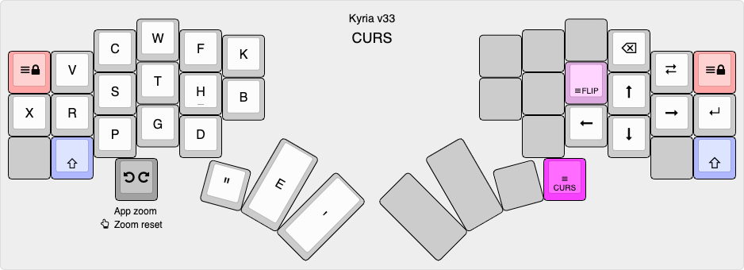
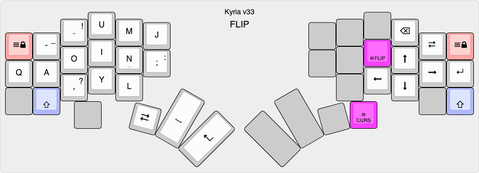

# Kyria RSTHD/Prime v33

This is the keymap for my Kyria keyboard from [splitkb.com](https://splitkb.com). The alpha layout was based on [RSTHD](https://xsznix.wordpress.com/2016/05/16/introducing-the-rsthd-layout/) but is now heavily modified. It's optimized for minimized usage of the inner index column. Features in the code include runtime switching between Mac/Windows/Linux shortcuts and a custom implementation of "comborolls".

<!--ts-->
   * [Overview](#overview)
      * [Goals](#goals)
      * [Keyboard configuration](#keyboard-configuration)
   * [Layers](#layers)
      * [ALPHA](#alpha)
      * [SYMS](#syms)
      * [EDIT](#edit)
      * [META](#meta)
      * [FUNC](#func)
      * [SNAP](#snap)
      * [CURS and FLIP](#curs-and-flip)
   * [Other](#other)
      * [How to build](#how-to-build)
      * [RSTHD variants and similar layouts](#rsthd-variants-and-similar-layouts)
      * [Relevant articles and resources](#relevant-articles-and-resources)
      * [Acknowledgments](#acknowledgments)

<!--te-->

## Overview

The alphabetic layout in this keymap was originally based on [RSTHD](https://xsznix.wordpress.com/2016/05/16/introducing-the-rsthd-layout/). I tried it, liked it, tweaked it, and tweaked some more...

When I originally started making changes to RSTHD, I called it RSTHD'. The `'`, pronounced "prime", is [used in maths](https://en.wikipedia.org/wiki/Prime_(symbol)#Use_in_mathematics,_statistics,_and_science) to indicate a derivative of the named thing. The layout still very much retains its RSTHD DNA despite all the changes. I figure calling it *RSTHD/Prime* acknowledges its origin while still indicating that it's different.

### Goals

Coming from a "slab" QWERTY keyboard to a programmable ergo split, I wanted to optimize:

- Cross-platform portability. I need to switch between macOS and Windows frequently. The differences in shortcuts and location of Ctrl/Cmd keys was frustrating and programmable keyboards seemed to be the answer.
- Comfort. For me, that largely means de-emphasizing the inner index columns.
- Better support for ambidextrous use of the trackpad or mouses (I use two). For example, it should be possible to do things like cut-copy-paste from either hand alone.

Typing speed and reducing the number of keys on the keyboard are not important goals to me.

### Keyboard configuration

My Kyria uses all 6 columns on each hand. The left side has an OLED, an encoder, and three thumb keys. The right side has no OLED or encoder, and four thumb keys. The top two thumb keys on each side are not on the board.

The controller is a Pro Micro and this keymap only just squeezes in.

Currently this might compile or work properly only on a v1 keyboard.

## Layers

There are a total of 8 layers. The first is the main alpha layer.

The other layers are activated with either a thumb or pinky. All are hold-to-activate. However the top corner keys are layer lock keys, which lock the layer on, or release it if it is locked. (A locked layer can also be released by pressing the layer key.)

Layer switching is done with custom code, so that a. shifted and custom keys can be emitted on the tap and b. so that the layer activates immediately for faster access to the keys in the layer. See `layer_tap_toggle.c/h`.

The layers have OS-specific shortcuts in various places. The platform (macOS, Windows, Linux) can be selected at run-time. For more info, see `os_shortcuts.h/c` and `os_shortcut_defs.h`. macOS shortcuts are pretty stable, Windows and Linux still need work.

### ALPHA


[KLE link](http://www.keyboard-layout-editor.com/#/gists/fd8f2b651f6708b30a515ef4f236e277)

The alpha layout aims to reduce lateral finger movement on the index finger. In fact the lower key of the inner column has been completely removed in this version. A slightly older version performed very well in an [analyzer](docs/prime-on-the-analyzer.md), with low SFU (same finger utilization) stats and low travel distance. For absolute minimum SFBs, swap P and F.  For lower left pinky usage (but higher inner index), swap V and J.

Some of the punctuation keys use non-standard shift mappings. See `shift_defs.h`.

Except for Shift, there are no modifiers on the alpha layer. To access them, use the SYMS or EDIT layer, hold the modifiers down, then release the layer key. (This is a bit like Callum mods except it doesn't use one-shots. It's not exactly how I wanted to do it, but it was easy to implement.)

There are a number of combos on this layer, defined with a bunch of macros to reduce boilerplate. I have a userspace implementation called "[comboroll](docs/comborolls.md)" to avoid timing issues with QMK's overlapping combos. See `combo_defs.h` for combo definitions.

This layout works best with comborolls as described at the link above. I recommend at a minimum setting up a combo for ER on the right hand. If that works out, add SP, ES, ED, and VE, then consider the rest of the combos in the [comborolls](docs/comborolls.md) note.

### SYMS

Activated by the left thumb.


[KLE link](http://www.keyboard-layout-editor.com/#/gists/1fe2cfee9a3cba7f4a122ce6527332ab)

Unshifted, this layer contains the rest of the punctuation characters. I've arranged them so that many common (for me) two-letter sequences can be typed with an inward roll. For example: ` <% %> </ /> => ~/`. Additional sequences such as `<?` `?>`  `!=` `);` are accessed with comborolls, to avoid flipping between the alpha and syms layers.

The ten digits are accessed with Shift, akin to [Programmer Dvorak](https://www.kaufmann.no/roland/dvorak/), but arranged in a 3x3 numpad-like grid.

Cut, copy and paste are chorded on the left hand top row.


### EDIT

Activated by the right thumb.


[KLE link](http://www.keyboard-layout-editor.com/#/gists/f6370a99eab0b9170893fc12354dc4c7)

This layer extends the idea of platform-independent shortcuts to a complete layer. The navigation keys on the left have the standard cursor keys, home, end and page up/down.

Modifiers are on the right hand. If one of the standard modifiers (Shift, Ctrl, Alt, Gui) is held, the emitted code is just the normal modifier + keycode. The special modifiers on the home row act as follows:

- **Delete** makes the action delete instead of moving.
- **More** makes the key do "more" : left and right move a word left or right; home and end move to the start and end of a paragraph; page up/down move to the start and end of the document. Up and down are an exception: these activate mouse wheel scrolling.
- **X4** makes the action repeat 4 times on every keypress or repeat.
- **Fast** removes the initial repeat delay and repeats at a faster interval.

All actions have auto-repeat. You can change the special modifiers while holding down a navigation key and the action changes accordingly.

Cut, copy and paste are chorded on the right hand top row.

### META
Activated by either pinky.


[KLE link](http://www.keyboard-layout-editor.com/#/gists/0c14a73c58276dd44af1fd28eef638b6)

This layer contains common shortcut keys. They are mostly arranged according to the letter used in the Mac/Windows shortcut. For example, the S key invokes Save (Cmd-S on Mac, Ctrl-S on Windows). However, the mapping is not always that straightforward (e.g. Cmd-Q on Mac and Alt-F4 on Windows), hence the need for a dedicated layer.

This layer is also how the FUNC and SNAP layers are accessed.


### FUNC

Activated by the left thumb from the META layer.


[KLE link](http://www.keyboard-layout-editor.com/#/gists/f449a968f9a64c6ebeebe3ff4b5ee3c6)

This layer contains function keys on the right hand, arranged roughly the same as the numpad. It also contains the keys that switch between macOS, Windows and Linux shortcuts.

Three mouse buttons are available on the right thumb.

### SNAP

Activated by the right thumb from the META layer.


[KLE link](http://www.keyboard-layout-editor.com/#/gists/6b8a2ef2ab72df3c36839a2a106f6303)

So called because of the keys for window snapping, which snap to one of the screen halves or quadrants. The center key sets the window to the full vertical height. This works on macOS if [Rectangle](https://rectangleapp.com) is running; not really working on Windows and Linux yet.

Three mouse buttons are available on the left thumb.

The encoder is used to control the backlight LEDs and OLED brightness (depending on which modifier is held.)

### CURS and FLIP

Activated by the right thumb. Experimental.



[KLE link](http://www.keyboard-layout-editor.com/#/gists/5b6ce99346e3a8f9fffa5e4b39318664)



[KLE link](http://www.keyboard-layout-editor.com/#/gists/8474e615b698442e7567f966f6e6c8df)

One-hand cursor diamond and flippable alpha keys. The alpha keys are for navigation in the macOS finder.


## Other

### How to build

If you'd like to try the keymap out, here's one way:

```
cd /path/to/workingdir
git clone https://github.com/frogm0uth/keyboard-firmware.git
```

Assuming you already have QMK set up using the documented method:

```
cd ~qmk_firmware/keyboards/splitkb/kyria/keymaps
ln -s /path/to/workingdir/keyboard-firmware/kyria-rsthd-prime .
qmk compile -kb splitkb/kyria/rev1 -km kyria-rsthd-prime
```


### RSTHD variants and similar layouts
- [T-34](https://www.jonashietala.se/blog/2021/06/03/the-t-34-keyboard-layout/) (swaps E and space)
- [New layout for lateral movement haters](https://www.reddit.com/r/KeyboardLayouts/comments/mnumbs/new_layout_for_lateral_movement_haters/) (Some similarities to this layout)
- [RSTHD today](https://xsznix.wordpress.com/2021/01/13/rsthd-today/) (Latest layout generated by keygen with revised scoring and different corpus)
- [andrewjrae/kyria-keymap](https://github.com/andrewjrae/kyria-keymap) (Swaps E and Space)
- [johnm/keymap.c](https://gist.github.com/johnm/e3c129b20bbcae97601e547a7dd9fa0a) (Mirrors the complete alpha block, and some other tweaks)
- [minidox RSTHD](https://github.com/qmk/qmk_firmware/tree/master/keyboards/maple_computing/minidox/keymaps/rsthd_combos) (Port of RSTHD to the MiniDox keyboard)

### Relevant articles and resources

- [Pressing E with the thumb‽](https://precondition.github.io/pressing-e-with-the-thumb) (Nice survey article of layouts with letters on a thumb key)
- [keymapDB](https://keymapdb.com) (Searchable site with summaries of a lot of neat keymaps)

### Acknowledgments

Table of contents created by [gh-md-toc](https://github.com/ekalinin/github-markdown-toc). To update, run

```
/path/to/gh-md-toc --insert README.md
```

Much inspiration came from the residents of the [splitkb discord server](https://splitkb.com/discord).

Thanks to the author of [RSTHD](https://xsznix.wordpress.com/2016/05/16/introducing-the-rsthd-layout/) for the great layout.

[QMK](https://qmk.fm) rocks!

