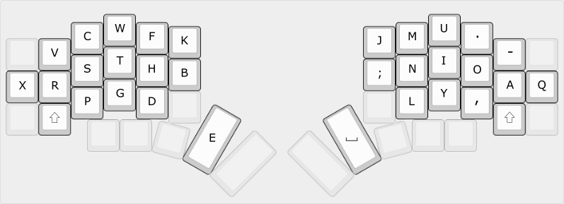
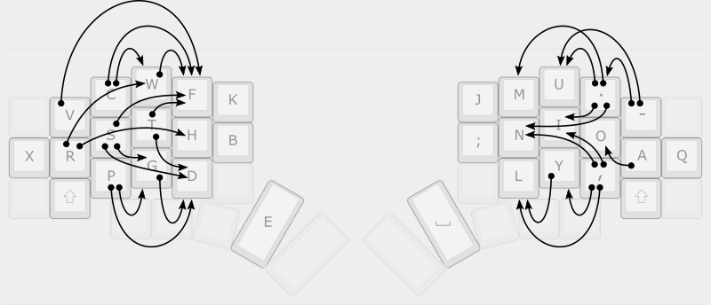
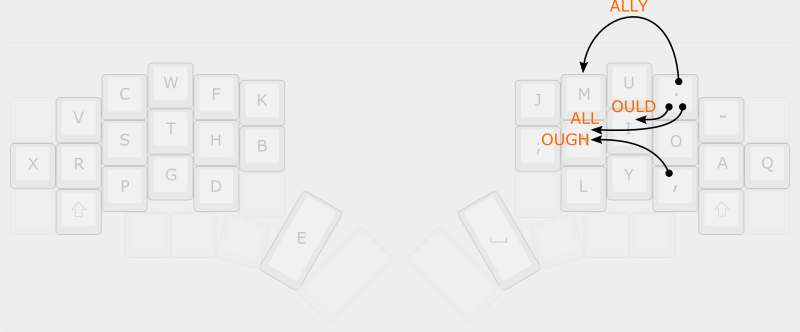
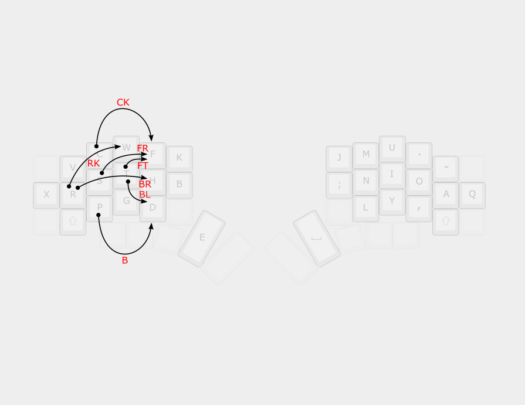
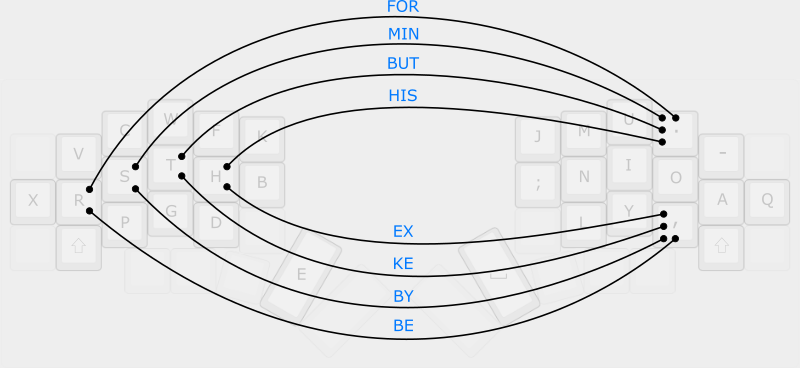

# Comborolls
*Or: a more methodical way of designing a combo layout for a split keyboard.*

A "combo" is the QMK name for a chord - when two keys pressed simultaneously produce an output that is not the same as the characters assigned to those keys. Combos can be used to produce individual characters - for example, to produce braces without leaving the alpha layer. Or they could be used for things like activating a layer. In this note I'll describe using them to emit a short sequence of characters to make typing flow better.

<!--ts-->
   * [Introduction](#introduction)
   * [The example key layout](#the-example-key-layout)
   * [The "method"](#the-method)
      * [Identify candidate locations for rolls](#identify-candidate-locations-for-rolls)
      * [Filter the candidates](#filter-the-candidates)
      * [Identify and place combos](#identify-and-place-combos)
   * [Identifying combos with examples](#identifying-combos-with-examples)
      * [Essential combos](#essential-combos)
         * [Anti-SFU](#anti-sfu)
         * [Anti-pinballing](#anti-pinballing)
         * [Awkward bigrams and trigrams](#awkward-bigrams-and-trigrams)
      * [Word endings](#word-endings)
      * [Typing comfort](#typing-comfort)
      * [The full set of comborolls](#the-full-set-of-comborolls)
      * [Two-hand combos](#two-hand-combos)
      * [Special cases](#special-cases)
   * [Discussion](#discussion)
      * [On typing with comborolls](#on-typing-with-comborolls)
      * [Length of combos](#length-of-combos)
      * [Number of combo/rolls](#number-of-comborolls)
   * [Implementation](#implementation)
      * [Combo definitions](#combo-definitions)
      * [QMK](#qmk)
      * [Custom implementation](#custom-implementation)
      * [RAM usage](#ram-usage)

<!-- Created by https://github.com/ekalinin/github-markdown-toc -->
<!-- Added by: username, at: Sat 16 Jul 2022 05:02:31 AEST -->

<!--te-->

## Introduction

Conventionally, combos are triggered when two keys are pressed at the same time. "The same time" means that the initial keypresses are within 50 ms (by default).

If you have a "rolling" style of typing, you may find that combos tend to interrupt the flow of typing. With a rolling style of typing, the keypresses are overlapped - that is, you press a key before releasing the preceding key.

Recently, it's been possible in QMK to specify that the trigger keys must be pressed in order. In this case, and if the time delay is extended to 150 ms, the keys can be "rolled". The time delay is long enough that you don't have to try to press them at the same time, and the combo triggers if you press the second key before releasing the first. This is what I call a "comboroll". They could be either inward or outward.

There are some issues in doing this in QMK, so for now I am using a custom implementation. In either case, it's led to a more methodical approach to placing combos in a keymap:

- All combos have two trigger keys only.
- Combos with both triggers on one hand are an inward comboroll.
- Combos with a trigger on each hand are a regular combo.

The idea of triggering a combo by rolling keys was inspired by the "adaptive keys" of the [Hands Down](https://sites.google.com/alanreiser.com/handsdown/home) series of keyboard layouts. There, a key may output a different letter depending on the preceding letter. However, if we think of a roll as just a different way to trigger a combo, we don't tie the output keys to the trigger keys. The thinking gets turned around: first, discover desirable sequences of output characters, and second, decide where to place them in the keymap.

## The example key layout

For reference, this is my key layout. It's necessary to show it to explain the examples, but otherwise the actual layout itself is not that important for this note. (That is, the placement of E on the thumb or the shift keys doesn't really affect the method being described.)



## The "method"

There are three things needed to define a combo/roll:

1. Places to put the trigger keys.
3. A reason to create the combo and the output string.
5. A mapping of the combo to the trigger keys.

### Identify candidate locations for rolls

The first step is to identify candidate locations for rolls based on comfort. Rolls on the same row are the most comfortable. The following diagram shows all possible same-row rolls:


Now remove those that are not comfortable when rolling. These are the ones in red. Typically, at least some of the rolls involving the pinky will be removed. In my case, I removed more on the left as it's less agile than the right pinky. Here's the set of initial candidates:


For a second set, also consider rolls that jump a row.

### Filter the candidates

Now filter the initial candidates by looking at the underlying letters. The simple method is to exclude any bigrams that occur with more than a certain frequency. Using the numbers in the bigram matrix of [Norvig's analysis](http://norvig.com/mayzner.html), my threshold seems to be 0.02%.

In my layout, any rolls involving the Shift keys are filtered out, because my implementation of comborolls doesn't work with one-shot shift.

Here are my same-row roll candidates after filtering:


After repeating the exercise with rolls that jump a row, here is my complete set of candidate locations:




### Identify and place combos

This could be thought of as two steps: a. identify and b. place. However, you do them one or a small number at a time. Furthermore, as you become familiar with the combos and identify new ones, you move them around to optimize for better typing. It's an iterative process.

I'll explain how to identify combos with the examples below. For now, here are some guidelines on placing a combo:

- Many layouts have a "consonant side" and a "vowel side". So place consonant-like comborolls on the consonent side and vowel-like comborolls on the vowel side.

- It's easier to remember the location if the first or last trigger key is in the combo. For example, "YOU" should have one of the trigger keys be either Y or U.

- Avoid placing a combo where the first or last trigger key creates SFUs or awkward moves with preceding or following letters (respectively).

- Place a combo so that a common following letter forms a three-roll. This only works with strong locations.

- If a combo is commonly followed by particular letters, consider making it a two-hand combo, as it's typically easier to roll a key on one hand with a following key than it is to roll a pair of keys with a following key on the same hand.

Typically, I find that I initially place a combo using the first two criteria (consonent/vowel and mnemonic). However, after using them for a while, they get moved in order to improve typing flow (the remaining criteria). The examples below show the final locations.

## Identifying combos with examples
Combos are identified in several groups.

### Essential combos

There are three types of "essential" combo: 

- Anti-SFU
- Anti-pinballing
- Awkward bigrams and trigrams

Here are mine (explanation below):


#### Anti-SFU

SFUs (same-finger utilization) aka SFBs (same-finger bigrams) are generally considered best minimized in a key layout. I've assigned the most frequent SC and SP to comborolls. EE is helpful because the thumb is a bit clumsy for double-tapping.

#### Anti-pinballing

"Pinballing" refers to more than one reversal of direction on the same hand. In this layout, for example, HERE has two reversals of direction on the left hand (the thumb is considered a finger for this purpose). This can be mitigated by changing the cadence of typing: rather than type as a single sequence, type as two rolls: HE - RE.

However, if ER is made a comboroll on the right hand, then the pinballing is instantly converted into a simple hand swap: H (left) - ER (right) - E (left). ED and ES are also useful anti-pinballing combos. VE is a late entry that turned out to be a surprisingly common bigram that solves pinballing for words like EVER.

ES  has the interesting property of reducing occurrences of the common SS double letter by about half.

#### Awkward bigrams and trigrams

Combos for awkward bigrams and trigrams move the typed keys to a more comfortable location. CR and PR are good examples: pinky and ring finger with a row jump change to a same-row roll. QU is more fluid with a combo when you consider that it's always followed by a vowel. The others I have are YOU (double row skip), MY (adjacent with double row) and GHT (reversal with a row skip).

### Word endings

From here on, finding combos is more optional. This group is common word endings that feel tedious to type over and over. My set is OUGH, OULD, ALL, and ALLY. ALL and ALLY reduce occurrences of the common double letter LL by about half.




### Typing comfort

My layout is driven by the desire to minimize use of the inner index column. This can be further reduced with combos. So there are a number of combos involving B and K. I also added some involving F. The FR, FT and BR combos change an awkward outward roll into a more comfortable inward roll.



Someone who doesn't have an issue with the inner index column might instead choose to use combos to improve comfort in other ways, such as to reduce pinky usage.

### The full set of comborolls

This is my full set of comborolls. Of the candidate locations, all but three have had combos assigned to them.


### Two-hand combos

Two-hand combos are triggered with one finger on each hand. With the explosion of choices for trigger pairs, you can easily end up with them all over the keymap, which becomes very hard to remember. A better approach is to choose a single trigger key that is used for all or most combos, then pair it with another key for mnemonics. For example, [precondition's keymap](https://github.com/precondition/dactyl-manuform-keymap) uses the thumb-located backspace key as the trigger: "Using Backspace+Letter(s) has the benefit of greatly reducing potential combo misfires as you're unlikely to type a letter and simultaneously delete it."

I don't have such a key available, so I use period and comma on the right hand and pair them with keys on the left. Period and comma might at first seem like a bad idea as they follow almost any other key. However, I type them as a roll with Space or Enter, so there's naturally a slighter longer time interval after the previous key. On the left hand, only the home row keys are used:



The assigned combos come from the categories discussed for comborolls earlier, and are typically switched to two-hand combos for easy rolling with a subsequent letter on one side. (Thus, I don't use mnemonic placement.) For example, BE is often followed by T or E, MIN is often followed by U or I, and so on. Two-hand combos *after* a letter are a bit tricky with timing, so these tend to be used when they occur at the start of a word.

### Special cases

There are a few additional combos for special cases that don't fit into the model above:


I've added *outward* rolls on the left hand for comma and period, to provide an alternative to the keys on the right hand. Using outward rolls as well as inward rolls to trigger combos is usually not a good idea as it gets too confusing, but these two are OK for me.

There are four vertical combos for anti-SFU. These are a little tricky to use and I'm still getting used to them.

## Discussion

### On typing with comborolls

When you have a combo defined for something, don't forget that the original keys are still there! So if the combo doesn't work well in some cases, don't force it, just use the original letters. For example, to type AIMED, you would use the E and D letters on the left hand rather than the ED combo on the right.

### Length of combos

When identifying combos, longer is not necessarily better. It might seem that splatting out a string of characters with a single combo is a big win, but long sequences also occur less frequently than shorter sequences. For example, at one time I had combos for EVER, EVEN, and VERY. But the single VE comboroll, *provided it has good placement*, takes care of all three cases and more besides. Similarly, IGHT was removed in favor of GHT, which turned out to be easier to use and also covers more cases.

### Number of combo/rolls

It's tempting to keep adding combos. However, it becomes harder to remember them and traing yourself to use them as the number gets higher.

My ability to remember and use combos starts to hit its limits at about three dozen (on the alpha layer). There are 28 locations in my keymap for comborolls, of which 25 are currently used, plus 8 two-hand combos and a few special cases (verticals and outward rolls).

## Implementation

### Combo definitions

I define all combos in `combo_defs.h`. A bunch of macros generate the necessary boilerplate. Defining combos is thus straightforward.

```
LtoR_STR( sc, KC_C, KC_W )
```

says that the C and W keys, rolled from left to right, emit "sc".

```
RtoL_STR( ed, KC_L, KC_Y )
```

specifies a roll from right to left, while

```
CMBO_STR( key,  KC_T, CU_DOT )
```

specifies a regular (or two-hand) combo.

```
_____TRM( ed, 200 )
```

says that the timeout to activate the ED combo is 200 ms.


### QMK

The QMK version can be compiled in by setting:

```
COMBO_ENABLE = yes
COMBOROLL_ENABLE = no
```

in `rules.mk`. In this case, `combos.c` is compiled in.

There is an issue with the QMK implementation. Specifically, if two combos are overlapping, QMK will output the second. However, when rolling, you really want the first to be output. As a workaround, specify in `config.h`:

```
#define COMBO_MUST_TAP_PER_COMBO
```

This will cause the first combo to be emitted, but also requires that the keys be released quickly. I'm still working to figure out the exact behavior provided and what would be needed to improve it. In the meantime, I use my custom implementation.

### Custom implementation

The custom implementation can be compiled in by setting:

```
COMBO_ENABLE = no
COMBOROLL_ENABLE = yes
```

in `rules.mk`. In this case, `comboroll.c` is compiled in.

This only supports two trigger keys and is less flexible in terms of what it can output (you can't use it to activate a modifier, for example), but the behavior with normal characters is better for the rolling typing described in this note.

It's also more space-efficient, so I don't have to turn anything else off to fit it into a Pro Micro.

### RAM usage

Both QMK combos and my custom implementation have an array of structs (one per combo) stored in **RAM**. As you add more combos, you use more RAM. The Pro Micro has only 2.5 kB or RAM, so depending on what else your code is doing, it is *possible* to run out.

Symptoms of running out of RAM: RGB LEDs turn off when you press certain keys, RGB adjustments stop working, OLED flickers on and off, keyboard stops responding entirely after typing a while, corrupted bootloader.

Check your data usage with something like this on the command line:

```
avr-size -C --mcu=atmega32u4 ~/qmk_firmware/.build/splitkb_kyria_rev1_kyria-rsthd-prime.elf
```

Result:
```
AVR Memory Usage
----------------
Device: atmega32u4

Program:   26914 bytes (82.1% Full)
(.text + .data + .bootloader)

Data:       2078 bytes (81.2% Full)
(.data + .bss + .noinit)
```

If the Data usage gets over 95%, you are getting close to having a problem. If you have a lot of strings in RAM (eg for status display on the OLED), move them to PROGMEM.
