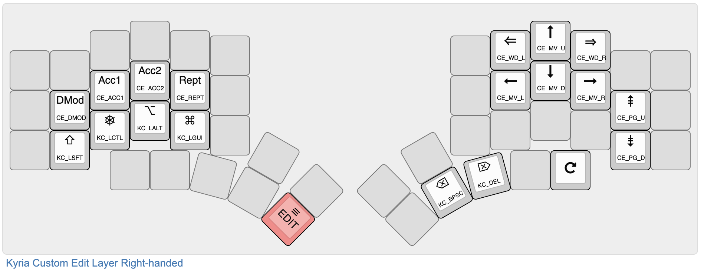

# Custom Edit - QMK notes

**THIS IS WILDLY OUT OF DATE.**

Custom Edit is an *experiment* in a set of platform-independent editing keys.
<!--ts-->
   * [Custom Edit - QMK notes](#custom-edit---qmk-notes)
      * [LIMITATIONS](#limitations)
      * [Rationale](#rationale)
   * [Description](#description)
      * [Typical layout](#typical-layout)
      * [Effect of Custom Edit keys, DMod not held](#effect-of-custom-edit-keys-dmod-not-held)
      * [Effect of Custom Edit keys, DMod held](#effect-of-custom-edit-keys-dmod-held)
   * [Usage](#usage)
      * [How to add to your keymap](#how-to-add-to-your-keymap)
      * [To turn off Custom Edit](#to-turn-off-custom-edit)
      * [Encoder support](#encoder-support)
      * [OLED support](#oled-support)
   * [Firmware size](#firmware-size)

<!--te-->

## LIMITATIONS

1. Windows shortcuts not fully sorted yet.
2. If more than one editing key is pressed at a time, it might not work properly.
3. Generally, still a work in progress.

## Rationale

While I mostly type on a Mac, I also need to use Windows on a regular basis. Unfortunately, most shortcuts related to navigation are different between the two platforms, leading to a lot of fumbles when I switch. For example, to move the cursor one word left on Mac, press Opt (aka Alt) plus left-arrow; on Windows, press Ctrl plus left-arrow.

Therefore, the Custom Edit feature defines a set of platform-independent editing keys. It relies on [OS Shortcuts](../../../tree/master/qmk-os-shortcuts/) for the correct shortcuts for each platform.

# Description

## Typical layout

Here is an example of how this could be used:



Keys not relevant to this note are greyed out. On the right hand, the cursor keys are in an inverted-T, with Word Left and Word Right keys (double arrows) and Page Up and Page Down keys arranged nearby.

On the left hand, the four standard modifiers are on the lower row. If any of these other than Shift are pressed, the keys on the right behave the same as normal cursor keys. (In that case, Word Left and Word Right map to Home and End.) This is intended mostly as a backup in case the Custom Edit keys miss something.

On the home row is a set of custom modifier keys. **Acc1** (CE_ACC1) magnifies the effect of the key, and **Acc2** (CE_ACC2) magnifies it even more. See the table below for details. There is no auto-repeat on the editing keys. Instead, the **Rept** modifier (CE_REPT) makes a key repeat while both are held. Finally, the delete modifier **DMod** (CE_DMOD) deletes text instead of moving the cursor.

The key that switches to the Edit layer is on the left thumb, in red. Other keys that are useful to add to this layer are dedicated cut/copy/paste keys, undo/redo keys, and keys for switching windows and tabs.

## Effect of Custom Edit keys, DMod not held

| Key     | No Modifier                     | Acc1 (CE_ACC1)                 | Acc2 (CE_ACC2)                    |
| ------- | ------------------------------- | ------------------------------ | --------------------------------- |
| CE_MV_L | Move cursor one character left  | Move cursor 5 characters left  | Move cursor to start of line      |
| CE_MV_R | Move cursor one character right | Move cursor 5 characters right | Move cursor to end of line        |
| CE_WD_L | Move cursor one word left       | Move cursor 5 words left       | Move cursor to start of paragraph |
| CE_WD_R | Move cursor one word right      | Move cursor 5 words right      | Move cursor to end of paragraph   |
| CE_MV_U | Move cursor one line up         | Move cursor 5 lines up         | Move cursor 12 lines up           |
| CE_MV_D | Move cursor one line down       | Move cursor 5 lines down       | Move cursor 12 lines down         |
| CE_PG_U | Scroll one screen up            | Scroll six screens up          | Move to start of document         |
| CE_PG_D | Scroll one screen down          | Scroll six screens down        | Move to start of document         |

## Effect of Custom Edit keys, DMod held

| Key     | DMod (CE_DMOD) held                                  | +Acc1 (CE_ACC1)                     | +Acc2 (CE_ACC2)              |
| ------- | ---------------------------------------------------- | ----------------------------------- | ---------------------------- |
| CE_MV_L | Delete one character to the left (same as Backspace) | Delete five characters to the left  | Delete to start of line      |
| CE_MV_R | Delete one character to the right (same as Delete)   | Delete five characters to the right | Delete to end of line        |
| CE_WD_L | Delete one word left                                 | Delete 5 words left                 | Delete to start of paragraph |
| CE_WD_R | Delete one word right                                | Delete 5 words right                | Delete to end of paragraph   |
| CE_MV_U | Delete the current line and move cursor up           | Delete 5 lines up                   | Delete 12 lines up           |
| CE_MV_D | Delete the current line and move cursor down         | Delete 5 lines down                 | Delete 12 lines down         |
| CE_PG_U | Do nothing                                           | Do nothing                          | Delete to start of document  |
| CE_PG_D | Do nothing                                           | Do nothing                          | Delete to start of document  |

# Usage

## How to add to your keymap

Note: the following assumes that you have a keymap.h file which is included by keymap.c and contains the definitions of the `layers` and `custom_keycodes` enums. The code can be obtained from my [Kyria keymap](../../../../keyboard-firmware/tree/master/kyria-rsthd-prime).

Note 2: Custom Edit requires [OS Shortcuts](../../../tree/master/qmk-os-shortcuts/).

To include Custom Edit in your keymap:

1. Drop the files custom_edit.c and custom_edit.h into your keymap folder.

2. Include custom_edit.h in your keymap.h file:

   ```c
   #include "custom_edit.h"
   ```

3. Add the following to your rules.mk:

   ```cmake
   CUSTOM_EDIT = yes	# Enable custom editing keys
   ...
   ifeq ($(strip $(CUSTOM_EDIT)), yes)
   	SRC += custom_edit.c
   	SRC += os_shortcuts.c
   	OPT_DEFS += -DCUSTOM_EDIT -DOS_SHORTCUTS
   endif
   ```

5. Add the following to your `custom_keycode` enum:

   ```c
   #ifdef CUSTOM_EDIT
     CUSTOM_EDIT_KEYS,
   #endif
   ```

6. Add the following inside the main switch of your process_record_user function:

   ```c
   #ifdef CUSTOM_EDIT
     CUSTOM_EDIT_PROCESS_RECORD(keycode, record);
   #endif
   ```

7. Finally, add the Custom Edit keycodes into your keymap.

## To turn off Custom Edit

To turn off Custom Edit, simply change the line in rules.mk:

```
CUSTOM_EDIT = no
```

In that case, the keycodes for moving the cursor will #define to the standard keycode equivalents (or Home for Word Left and End for Word Right). The modifier keycodes will #define to KC_NO. This is handy if you need to disable it temporarily to test the normal keycodes, check firmware space usage, and so on, as you don't get compile errors.

## Encoder support

If you have encoders, add the following to your `encoder_update_user` function:

```c
#ifdef CUSTOM_EDIT
      custom_edit_encoder(clockwise);
#endif
```

This table lists the operation *per click*:

| Direction         | No Modifier                     | Acc1                       | Acc2                                                         |
| ----------------- | ------------------------------- | -------------------------- | ------------------------------------------------------------ |
| Counter-clockwise | Move cursor one character left  | Move cursor one word left  | Move cursor to start of this paragraph, or to start of previous paragraph |
| Clockwise         | Move cursor one character right | Move cursor one word right | Move cursor to end of paragraph, or end of next paragraph    |

If **DMod** is held, the operations are the same but delete text instead of moving the cursor.

If **Rept** is held, the orientation changes to vertical and the operations are the same as listed for key presses earlier on this page. 

## OLED support

If you have an OLED, add something like the following to your `oled_task_user` function: 

```c
switch (get_highest_layer(layer_state)) {
#ifdef CUSTOM_EDIT
    case EDIT:
      custom_edit_status();
      break;
#endif
...
}
oled_write_P(PSTR("\n"), false);
```

# Firmware size

In my Kyria keymap, Custom Edit adds about 1350 bytes to the size. That includes the OLED and encoder support functions. About 200 bytes is due to the use of OS Shortcuts (dynamically rather than statically defined shortcuts).

