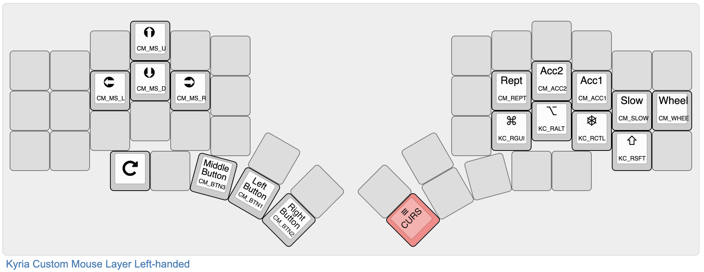

# Custom Mouse - QMK notes

**THIS IS NOW IN THE [ATTIC](attic.md).**


Custom Mouse is an *experiment* in an alternate set of mouse keys with better control.
<!--ts-->
   * [Custom Mouse - QMK notes](#custom-mouse---qmk-notes)
      * [LIMITATIONS](#limitations)
      * [Rationale](#rationale)
   * [Description](#description)
      * [Typical layout](#typical-layout)
      * [Effect of Accelerator keys, Wheel not held](#effect-of-accelerator-keys-wheel-not-held)
      * [Effect of Accelerator keys, Wheel is held](#effect-of-accelerator-keys-wheel-is-held)
   * [How to use](#how-to-use)
      * [How to include Custom Mouse in your keymap](#how-to-include-custom-mouse-in-your-keymap)
      * [To turn off Custom Mouse](#to-turn-off-custom-mouse)
      * [Encoder support](#encoder-support)
      * [OLED support](#oled-support)
   * [Firmware size](#firmware-size)

<!--te-->

## LIMITATIONS

1. The wheel stuff is weird/non-obvious and needs work.
2. Generally, still a work in progress.

## Rationale

While the inbuilt QMK mouse keys are useful, I found it a bit hard to control and tended to overshoot. It's also not possible to make very small cursor movements, which is a good use case for mouse keys versus a mouse. And the buttons can't be held down, they are click (tap) only.

Therefore, the Custom Mouse feature changes the way that accelerator keys work with the mouse buttons so that mouse movement can be in increments as small as one pixel or as much as 127 pixels (the maximum). A key repeats only while a **Rept** modifier is held down. The button keys act as separate press and release events, so you can do drag operations (for example, drag-select or resize a window).

Finally, a dedicated modifier key changes from mouse movement to wheel scrolling.

# Description

## Typical layout

Here is an example of how this could be used:



Keys not relevant to this note are greyed out. On the left hand, the mouse keys are in an inverted-T, with button keys on the thumbs.

On the right hand, the four standard modifiers are on the lower row. These are intended for use in conjunction with the button keys.

On the home row is a set of custom modifier keys. **Acc1** (CM_ACC1), **Acc2** (CM_ACC2) and **Slow** (CM_SLOW) have the effect shown in the table below. There is no auto-repeat on mouse keys. Instead, the **Rept** modifier (CM_REPT) makes the key repeat while it is held. The Wheel (CM_WHEE) key makes the mouse keys send wheel events while it is held.

The key that switches to the Cursor layer is on the right thumb, in red. Other keys that are useful to add to this layer are screenshot and cut/copy/paste keys.

## Effect of Accelerator keys, Wheel not held

The table below shows the effect of the Slow and accelerator keys when **Wheel** is not held.

| Slow | Acc1 | Acc2 | Status  | Pixels |
| :--: | :--: | :--: | :-----: | :----: |
|  ✔   |  ✔   |  ✔   |   –4    |   1    |
|  ✔   |  —   |  ✔   |   –3    |   2    |
|  ✔   |  ✔   |  —   |   –2    |   4    |
|  ✔   |  —   |  —   |   –1    |   8    |
|  —   |  —   |  —   | (Blank) |   16   |
|  —   |  ✔   |  —   |   +1    |   32   |
|  —   |  —   |  ✔   |   +2    |   64   |
|  —   |  ✔   |  ✔   |   +3    |  127   |

## Effect of Accelerator keys, Wheel is held

The table below shows the effect of the Slow and accelerator keys when **Wheel** is held. **TBC**

| Slow | Acc1 | Acc2 | Status  | Pixels | Time (ms) |
| :--: | :--: | :--: | :-----: | :----: | --------- |
|  ✔   |  ✔   |  ✔   |         |   ?    | TBC       |
|  ✔   |  —   |  ✔   |         |   ?    |           |
|  ✔   |  ✔   |  —   |         |   ?    |           |
|  ✔   |  —   |  —   |         |   ?    |           |
|  —   |  —   |  —   | (Blank) |   ?    |           |
|  —   |  ✔   |  —   |   +1    |   ?    |           |
|  —   |  —   |  ✔   |   +2    |   ?    |           |
|  —   |  ✔   |  ✔   |   +3    |   ?    |           |

# How to use

## How to include Custom Mouse in your keymap

Note: the following assumes that you have a keymap.h file which is included by keymap.c and contains the definitions of the `layers` and `custom_keycodes` enums. The code can be obtained from my [Kyria keymap](../../../../keyboard-firmware/tree/master/kyria-rsthd-prime).

To include Custom Mouse in your keymap:

1. Drop the files custom_mouse.c and custom_mouse.h into your keymap folder.

2. Include custom_mouse.h in your keymap.c (or keymap.h if you have one):

   ```c
   #include "custom_mouse.h"
   ```

3. Add the following to your rules.mk:

   ```cmake
   CUSTOM_MOUSE = yes	# Enable custom mouse keys
   ...
   ifeq ($(strip $(CUSTOM_MOUSE)), yes)
   	SRC += custom_mouse.c
   	OPT_DEFS += -DCUSTOM_MOUSE
   endif
   ```

3. Add the following to your `custom_keycode` enum:

   ```c
   #ifdef CUSTOM_MOUSE
     CUSTOM_MOUSE_KEYS,
   #endif
   ```

4. Add the following inside the main switch of your process_record_user function:

   ```c
   #ifdef CUSTOM_MOUSE
     CUSTOM_MOUSE_PROCESS_RECORD(keycode, record);
   #endif
   ```

5. Finally, add the Custom Mouse keycodes into your keymap.

## To turn off Custom Mouse

To turn off Custom Mouse,  change the line in rules.mk:

```
CUSTOM_MOUSE = no
```

If you have MOUSEKEY_ENABLE on, the Custom Mouse keycodes will #define to the nearest equivalent, except for **Rept** and **Wheel** which have no equivalents. Otherwise, they will #define to KC_TRNS. This is handy if you need to disable it temporarily for testing or to check firmware space usage, as you don't get compile errors.

## Encoder support

If you have encoders, add the following into your `encoder_update_user` function:

```c
#ifdef CUSTOM_MOUSE
      custom_mouse_encoder(clockwise);
#endif
```

This should only be called while on the mouse key layer so that the custom modifier keys are present. The encoder will move the mouse right (on clockwise motion) and left (counter-clockwise) by the number of pixels set by the **Slow** and accelerator keys. If the **Rept** key is held, motion switches to down (clockwise) and up (counter-clockwise).

A second function allows use of the wheel on a different layer, like this:

```c
#ifdef CUSTOM_MOUSE
      custom_wheel_encoder(clockwise, true);
#endif
```

With the second argument true, this moves the wheel down and up, which is a good default if intended for scrolling through a page. If the second argument is false, the wheel moves left and right.

## OLED support

If you have an OLED, add something like the following to your `oled_task_user` function: 

```c
switch (get_highest_layer(layer_state)) {
#ifdef CUSTOM_MOUSE
    case CURSOR:
      custom_mouse_status();
      break;
#endif
...
}
oled_write_P(PSTR("\n"), false);
```

# Firmware size

In my Kyria keymap, Custom Mouse adds about 1850 bytes to the size. That includes the OLED and encoder support functions. In comparison, the standard QMK mouse key functionality adds about 1500 bytes.

