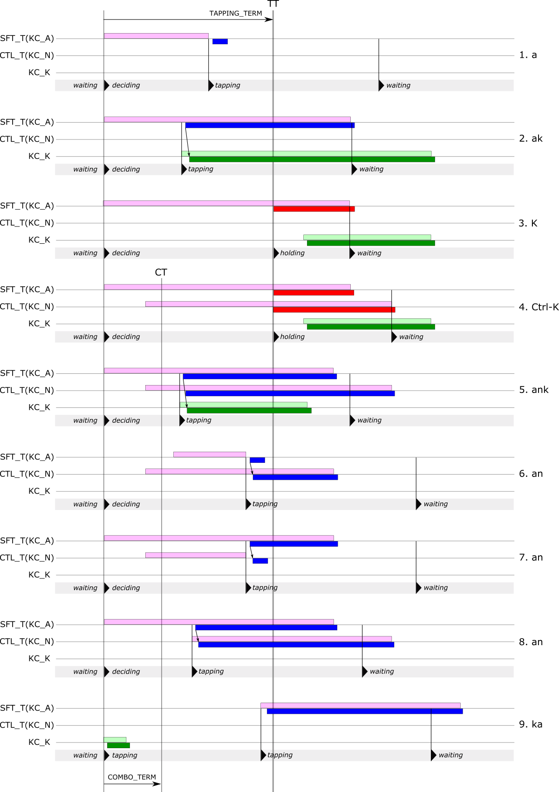

# Eager mod-taps

**WORK IN PROGRESS**

This is a *thought experiment* on a different mode of operation for mod-taps. I use the word "eager" to mean that mod-tap keys output their tap code as soon as possible.

(This is the new version with graphical scenarios. For more detailed analysis with textual scenarios, see the [old version](eager-modtaps-long.md).) 

<!--ts-->
   * [Rationale/background](#rationalebackground)
   * [Operation](#operation)
      * [Waiting](#waiting)
      * [Deciding](#deciding)
      * [Tapping](#tapping)
      * [Holding](#holding)
      * [Discussion](#discussion)
   * [Scenarios](#scenarios)
   * [Implementation and other thoughts](#implementation-and-other-thoughts)
<!--te-->

## Rationale/background

I'm one of those unfortunates that can't use home-row mods. The timing throws me off and I accidentally trigger who-knows-what shortcuts. This is a fairly scary thing to happen, so I turned them off fairly quickly after trying them.

A recent discussion on the splitkb discord had me wondering about whether there might be a different timing of mod-taps that would enable me to use home-row mods. This note is the result. As far as I know, the behavior described here is not currently available in either QMK or ZMK (the latter based only on reading the documentation).

## Operation

The keyboard is in one of four modes:

1. *Waiting*
2. *Deciding*
3. *Tapping*
4. *Holding*

There are two *terms* of interest: *tapping term*, which is by default 200 ms, and *combo term*, which is by default 50 ms. I'll use the abbreviation MT to mean "the time that is tapping term ms after the first mod-tap key press (or equivalently, the start of the *deciding* mode)", and similarly for CT.

Each mod-tap key has two codes: the tap code and the hold code (i.e. a modifier). To avoid ambiguous use of the word "hold", if an MT key has been pressed but it's not yet time to register either its tap code or hold code, it is "suspended".

### Waiting

While in this mode, nothing interesting is happening. From here, the keyboard can start tapping or deciding:

> 1. Stop *waiting* and start *deciding* when a mod-tap key is pressed.

> 2. Stop *waiting* and start *tapping* when a non-MT key is pressed.

### Deciding

A mod-tap key has been pressed, but we don't know yet whether to start tapping or holding. Suspend fhe first mod-tap key and subsequent mod-tap keys.

> 3. Stop *deciding* and start *tapping* when:
>      - A non-MT key is pressed, or
>      - An MT key is pressed after CT, or
>      - An MT key is released.

> 4. Stop *deciding* and start *holding* when TT is reached.

### Tapping

Unsuspend any suspended mod-tap keys and register their *tap codes* in the order pressed. Then register the key that triggered the move to tapping, if there is one. If it's a mod-tap key, register its *tap code*.

Process any subsequent keys as normal &ndash; key presses cause a register event, key releases cause an unregister event. If any of these keys is a mod-tap, register/unregister its *tap code*.

> 5. Stop *tapping* and start *waiting* when tapping term has elapsed since the last key registration.

### Holding

Unsuspend any suspended mod-tap keys and register their *hold codes*.

Process any subsequent keys as normal &ndash; key presses cause a register event, key releases cause an unregister event. If any of these keys is a mod-tap, register/unregister its *tap code* **unless** it's the release event of a held mod-tap key, in which case unregister its *hold code*.

> 6. Stop *holding* and start *waiting* when the last held MT key is released.

### Discussion

The resulting mod-tap behavior is very biased toward generating tap codes in preference to hold codes (modifiers). In normal typing, I hope it will be very uncommon to accidentally register a modifier. That will require a more deliberate action:

1. Wait a short time (tapping term) after pressing any key before pressing a mod-tap key
2. Wait a short time (tapping term) after pressing a mod-tap key before pressing another key

Granted, this might slow typing down when Shift is considered, but I'm thinking it would be no worse than say auto-shift. This idea of eager mod-taps could perhaps be thought of as adding modifiers to normal keys, rather than adding tap codes to modifier keys.

I'm aware that some of the transition rules could be refined a bit. However, I think these are the simplest that will work, so I'll start with them and see how it goes.

## Key press-release scenarios

The image below illustrates a number of key press-release scenarios. **A** and **N** are mod-tap keys, and **K** is a normal (non-MT) key. The light bars above the line indicate the period when a key is down and the darker bars below the line indicate when the key is registered and unregistered to the computer: red is a modifier, blue is the tap code of a mod-tap, green is a non-MT key.

Here is a brief explanation of each scenario. A comparison to QMK behavior (\*) is given if it is different.

1. A mod-tap key is pressed and then released before TT. Start  *tapping* mode. The output is `a`.
2. A mod-tap key is pressed, then a non-MT key is pressed before TT. Start  *tapping* mode. The output is `ak`. (In QMK, this sequence would output `K`. In order to output `ak`, the MT key must be released before TT.)
3. A mod-tap key is held until TT and no other keys are pressed. Start  *holding* and register the MT hold code. Then a non-MT key is pressed. The output is `K`.
4. Two MT keys are pressed before CT and held until TT, and no other keys are pressed. Start  *holding* and register both MT hold codes.  Then a normal key is pressed. The output is `Ctrl-K`.
5. Two MT keys are pressed before CT, then a non-MT key is pressed before TT. Start  *tapping* mode. The output is `ank`. (In QMK, this sequence would output `Ctrl-K`. In order to output `ank`, both MT keys must be released before TT.)
6.  Two MT keys are pressed before CT and the first is released before TT. Start  *tapping* mode. The output is `an`. (In QMK, this sequence would output `a`. In order to output `an`, the second MT key must also be released before TT.)
7.  Two MT keys are pressed before CT and the second is released before TT. Start  *tapping* mode. The output is `an`. (In QMK, this sequence would output `N`. In order to output `an`, the first MT key must also be released before TT.)
8. An MT key is pressed before CT and a second is pressed after CT but before TT. Start  *tapping* mode. The output is `an`. (In QMK, this sequence would output `Ctrl-K`. In order to output `an`, both MT keys must be released before TT.)
9. A non-MT key is pressed. Start  *tapping* mode. An MT key is then pressed within a further tapping term. The output is `ka`.

QMK will register the modifiers in more cases. Its output also depends on not just the timing but also the **order** of key *releases*. Eager mod-taps are less sensitive to release timing, and insensitive to release order. Release timing is significant in the cases where *only* mod-tap keys are pressed and all are pressed before CT, in which case at least one must be released before TT to trigger *tapping* mode.

## Implementation and other thoughts

I'm planning to try and implement this as a userspace proof-of-concept in QMK. If so, I'll be able to see what it's like to use.

There will be no doubt be interactions with combos. I will most likely have to disable them, at least initially. 

**Footnote**

(\*) By "QMK behavior", I mean the case where IGNORE_MOD_TAP_INTERRUPT is defined and PERMISSIVE_HOLD is **not** defined. For a more detailed analysis, see the [old version](eager-modtaps-long.md#versus-qmk) of this note.
