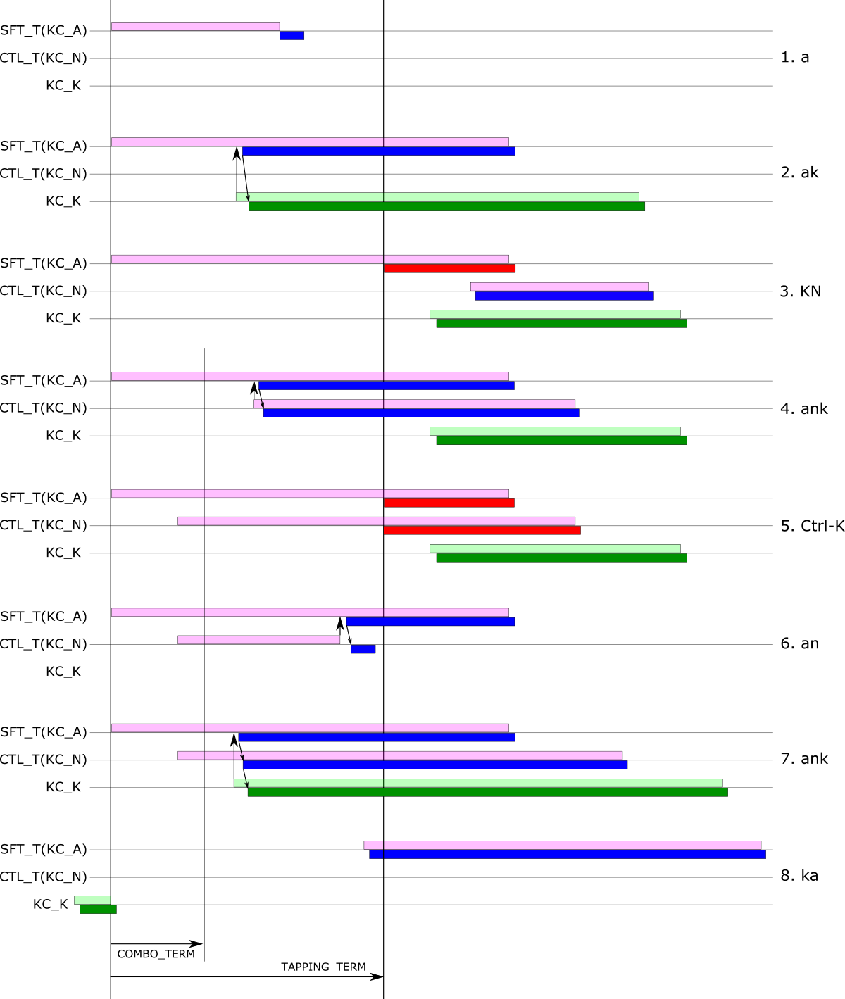

# Eager tap-mods

**WORK IN PROGRESS**

This is a *thought experiment* on tapping early and holding later. (So it could also be called early tap-mods, late mod-taps, delayed mod-taps, lazy holds, ...) The word "eager" is used to mean that it outputs a tap code as soon as there's any indication that you *might not* want to hold.


<!--ts-->
   * [Rationale/background](#rationalebackground)
   * [Principles](#principles)
   * [Resulting behavior](#resulting-behavior)
   * [Scenarios (textual)](#scenarios-textual)
   * [Variants](#variants)
      * [Combo-like modtaps](#combo-like-modtaps)
      * [One-shots](#one-shots)
      * ["Forced" one-shots](#forced-one-shots)
   * [Scenarios (graphical)](#scenarios-graphical)
   * [Versus QMK](#versus-qmk)
   * [Versus ZMK](#versus-zmk)
   * [Implementation](#implementation)

<!-- Created by https://github.com/ekalinin/github-markdown-toc -->
<!-- Added by: username, at: Wed 20 Jul 2022 03:39:33 AEST -->

<!--te-->

## Rationale/background

I'm one of those unfortunates that can't use home-row mods. The timing just throws me off and I instantly make errors. However, I recently learnt in the splitkb discord about ZMK's "tap-preferred" flavor of mod-tap and the "global-quicktap" option. It turned out they weren't quite what I thought they were, so I decided to take a step back and think about what *might* make home-row mods work for me.

As far as I know, this behavior is not currently available in either QMK or ZMK (the latter based only on reading the documentation).

## Principles
The keyboard is always in one of three modes:
1. *Deciding*
2. *Tapping*
3. *Holding*

There are two timeouts aka terms of interest: *tapping term* (TT) which is by default 200 ms, and *combo term* (CT) which is by default 50 ms. For now, we use only TT, CT will be considered later.

Each mod-tap key has two codes: the tap code and the hold code (i.e. a modifier). To avoid ambiguous use of the word "hold", if an MT key has been pressed but it's not yet time to register either its tap code or hold code, it is "suspended".

While *deciding*, no characters or modifiers are output to the computer. Pressed mod-tap keys will be suspended.

When the keyboard decides to start *tapping*, any suspended mod-tap keys are unsuspended and their *tap codes* are registered. Subsequent keys are then processed as normal &ndash; key presses cause a register event, key releases cause an unregister event. If any of these keys are mod-taps, the *tap code* is registered/unregistered.

When the keyboard decides to start *holding*, any suspended mod-tap keys are unsuspended and their *hold codes* are registered. Any subsequent keys are then processed as normal &ndash; key presses cause a register event, key releases cause an unregister event. If any of these keys are mod-taps, the *tap code* is registered/unregistered unless it's a release event for one of the held mod-tap keys, in which case the *hold code* is unregistered.

The rules for changing modes are:
1. The keyboard decides to start or continue *tapping* when:
    - A non-MT key is pressed or released, or
    - An MT key is released.
2. The keyboard decides to start *holding* when one or more MT keys are suspended and TT is reached.
3. The keyboard decides to stop *tapping* and go back to *deciding* when TT has elapsed since the last key release.
4. The keyboard decides to stop *holding* and go back to *deciding* when the last held MT key is released.

Note that the keyboard never moves directly from *tapping* to *holding* or vice versa.

## Resulting behavior

The result (I hope) of the above is that the mod-tap behavior is very oriented towards generating the tap codes. So in normal typing, even I wouldn't accidentally generate modifier codes. Generating the hold codes however, is a more deliberate action that requires:

1. Waiting a short time after pressing any key before pressing a mod-tap key
2. Waiting a short time after pressing a mod-tap key or keys and pressing another key

The "short time" here is of course the tapping term, or 200 ms. More a slight pause than a wait. For some people, this might slow things down for regular typing (using shift), but I'm thinking not really any more than say auto-shift. However, it needs to be implemented and tried out to really know.

## Scenarios (textual)

Below are a number of scenarios illustrating the behavior. See further below for a graphical version.

The notation is as follows: `A.` means the A key is pressed, `A^` means the A key is released, `||` means the end of tapping term, `(x.)` means `register_code(KC_X)`, `(x^) `means `unregister_code(KC_X)`. O and N are on the home row, O is the shift mod-tap, N is Ctrl mod-tap, J is not a home row key. `->` indicates the characters that will be seen on screen.  

```
1.   O. O^ (o. o^)           ||                                                     -> o
2.   O.                      || (SFT.)       O^ (SFT^)                              -> 
3.   O. J. (o. j.)           ||              O^ (o^) J^ (j^)                        -> oj
4.   O. J. (o. j.) J^ (j^)   ||              O^ (o^)                                -> oj
5.   O. J. (o. j.) O^ (o^)   ||              J^ (j^)                                -> oj
6.   O.                      || (SFT.)       J. (j.) O^ (SFT^) J^ (j^)              -> J
7.   O.                      || (SFT.)       N. (n.) O^ (SFT^) N^ (n^)              -> N
8.   O. N.                   || (SFT. CTL.)  O^ (SFT^) N^ (CTL^)                    -> 
9.   O. N.                   || (SFT. CTL.)  J. (j.) O^ (SFT^) N^ (CTL^) J^ (j^)    -> Ctrl-J
10.  O. N. O^ (o. n. o^)     ||              N^ (n^)                                -> on
11.  O. N. N^ (o. n. n^)     ||              O^ (o^)                                -> on
12.  O. N. J. (o. n. j.)     ||              O^ (o^) N^ (n^) J^ (j^)                -> onj
13.  J. (j.) O. (o.)         ||              O^ (o^) J^ (j^)                        -> jo
13a. J. (j.) J^ (j^) O. (o.) ||              O^ (o^)                                -> jo
```

Notes:
1. Same as any mod-tap flavor
2. Same as any mod-tap flavor
3. Decide on tap on non-MT key. ZMK docs text suggests that tap-preferred flavor does this but diagram says otherwise (4.b)
4. Same as (3), the decision is already made on second key down 
5. Also same as (3)
6. Same as (2), decision is made at end of tapping term
7. If already in hold mode, another MT key is always tap
8. If second key within TT is also MT, wait until end of term to activate mods. This should maybe be a shorter time like say COMBO_TERM 
9. Same as (8), decision already made at end of term
10. Releasing MT within TT triggers tap
11. Same as (10) 
12. Non-MT key triggers tap outputs
13. This is ZMK "global quick tap"

## Variants

### Combo-like mod-taps

It might be desirable to limit activation of multiple modifiers to "being pressed at the same time". For example, it might seem irregular that typing OJ will produce output immediately, but typing ON will not produce output until one of them is released. If all mod-taps had to be pressed within CT (instead of TT) to be held, this might be allieviated (\*). In effect, activating multiple modifiers would be like triggering a combo.

Let `|` indicate expiration of CT, then (8) and (9) become two scenarios each:

```
8a. O. N. |               || (SFT. CTL.)  O^ (SFT^) N^ (CTL^)                    -> 
8b. O.    | N. (o. n.)    ||              O^ (o^) N^ (n^)                        -> on
9a. O. N. |               || (SFT. CTL.)  J. (j.) O^ (SFT^) N^ (CTL^) J^ (j^)    -> Ctrl-J
9b. O.    | N. (o. n.)    ||              J. (j.) O^ (o^) N^ (n^) J^ (j^)        -> onj
```

(\*) Assuming it's an issue at all...

### One-shots

This could be changed a little so that modifiers acted like one-shots. In that case, there would be additional scenarios like this:

```
14. O.                   || (SFT.)       O^ J. (j. SFT^) J^ (j^)                -> J
15. O. N.                || (SFT. CTL.)  O^  N^ J. (j. SFT^ CTL^) J^ (j^)       -> Ctrl-J
```

### "Forced" one-shots

I don't know if there's a name for this, but by "forced" one-shot I mean the modifier acts as a one-shot even if it's held down. This may help avoid errors like "THe". In that case, (6) and (7) would be:

```
6. O.                    || (SFT.)       J. (j. SFT^) O^ J^ (j^)               -> J
7. O.                    || (SFT.)       N. (n. SFT^) O^ N^ (n^)               -> N
```

Those have the same output as the earlier (6) and (7), so to emphasize the point:

```
16. O.                   || (SFT.)       J. (j. SFT^) K. (k.) J^ (j^) K^ (k^) O^ -> Jk
17. O.                   || (SFT.)       N. (n. SFT^) J. (j.) O^ N^ (n^) J^ (j^) -> Nj
``` 


## Scenarios (graphical)

The image below shows a number of scenarios that shoudl result from following *Principles* above. I'm assuming now that the "combo-like" multiple mod-taps are implemented.



1. Mod-tap key is released before TT: its tap code is output.
2. Non-MT key is pressed before TT: both keys have the tap code output.
3. MT key is held until TT: its hold code is output. 
4. A second MT key is pressed after CT but before TT: both tap codes are output.
5. Two MT keys are pressed before CT and both held until TT: both hold codes are output.
6.  Two MT keys are pressed before CT and one is released before TT: both tap codes are output.
7.  Two MT keys are pressed before CT and a non-MT key is pressed before TT: all tap codes are output.
8. A non-MT key is pressed and an MT key is then pressed within TT: both tap codes are output.

## Versus QMK

TBD


## Versus ZMK

The [ZMK docs on hold-tap](https://zmk.dev/docs/behaviors/hold-tap) (see also [proposal PDF](https://github.com/zmkfirmware/zmk/files/5111053/zmk-modtap-proposal.pdf)) state that "The 'tap-preferred' flavor triggers the hold behavior when the `tapping-term-ms` has expired. *It triggers the tap behavior when another key is pressed.*" (My emphasis.) However, examining the tap-preferred diagrams that follow, here are those scenarios ("**z**N.x") using my notation, followed by the scenario with the same key press/release/timing for my proposal:

```
z4.a O. J.                 || (SFT. j.)    J^ (j^) O^ (SFT^)                      -> J
3a.  O. J. (o. j.)         ||              J^ (j^) O^ (o^)                        -> oj
z4.b O. J. J^              || (SFT. j. j^) O^ (SFT^)                              -> J
4.   O. J. (o. j.) J^ (j^) ||              O^ (o^)                                -> oj
z4.c O. J. J^ O^ (o. j. j^ o^)     ||                                             -> oj
4.   O. J. (o. j.) J^ (j^) O^ (o^) ||                                             -> oj
z4.d O. J. O^ (o. j. o^)   ||              J^ (j^)                                -> oj
5.   O. J. (o. j.) O^ (o^) ||              J^ (j^)                                -> oj
```

As can be seen, my proposal is even more tap preferred than ZMK tap-preferred, as it will output the tap codes (oj) in cases where ZMK will output the hold code (producing J). I don't know why ZMK is like this and it's quite possible I'm missing something.

## Implementation
I'm wondering if I can implement this as a userspace proof-of-concept in QMK. If so, I'll see what it's like to use...
