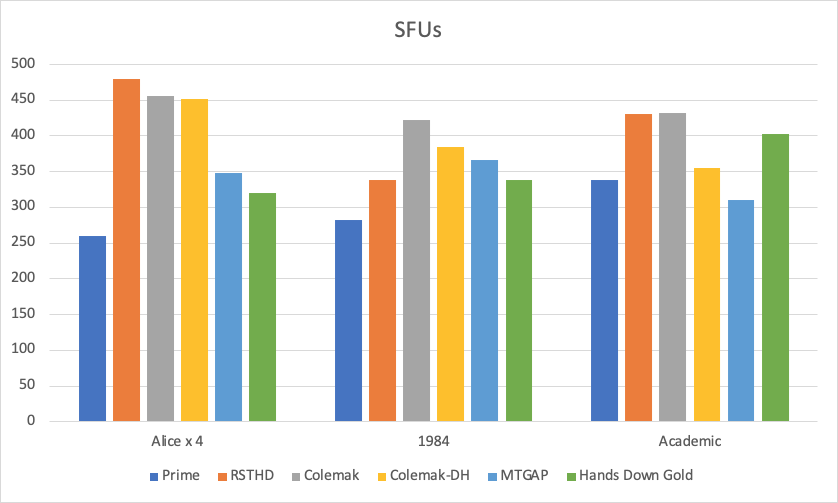

# RSTHD/Prime on the analyzer

Keyboard analyzers are a useful tool for working on a custom keymap. They do have some significant limitations though, so results must always be "taken with a grain of salt."

**Contents**

<!--ts-->
   * [SteveP's analyzer](#steveps-analyzer)
   * [Fitting the keymap into the analyzer](#fitting-the-keymap-into-the-analyzer)
   * [Heatmap](#heatmap)
   * [Finger distribution](#finger-distribution)
   * [SFUs](#sfus)
   * [Travel distance](#travel-distance)
   * [Summary scores](#summary-scores)
<!--te-->

## SteveP's analyzer

[SteveP's analyzer](https://stevep99.github.io/keyboard-layout-analyzer/#/main) ([github](https://github.com/stevep99/keyboard-layout-analyzer)) is a fork of the [original KLA](https://patorjk.com/keyboard-layout-analyzer/#/main) ([github](https://github.com/patorjk/keyboard-layout-analyzer)). This is a moderately powerful analyzer with a nice web-based GUI that allows for a single extra layer. The metrics are baked in (you can't change the weighting of the penalties yourself) and it doesn't analyze key sequences except for looking at SFUs.

The corpora used below are the provided *Alice in Wonderland*, *1984*, and the academic paper *Cost Optimization Model*. I use the inbuilt ones to make it easy for anyone to reproduce the results or compare with different layouts.

I've not included code samples because the analyzer counts leading white space. (Layouts with Enter and Space on the same thumb will therefore be heavily penalized, whereas in actual fact in a coding editor you don't need to type anything but the Enter.)

I compare against a number of other built-in layouts: RSTHD, Colemak thumbshift, Colemak-DH thumbshift, and MT-GAP thumbshift. They generally perform best of all the pre-loaded layouts (that I've found). I also include the newer [Hands Down Gold](https://sites.google.com/alanreiser.com/handsdown/home/hands-down-neu) layout in the comparisons, as it has a letter (T) on a thumb key and the author has helpfully provided a JSON file.

## Fitting the keymap into the analyzer
The actual keymap can't be fully expressed in the analyzer. Ignoring combos, I also have a number of characters that are duplicated in the keymap, so for the analyzer I've picked the likely best location.

You can load the [JSON](kyria-rsthd-prime-v32.json) into the analyser yourself to have a closer look.

## Heatmap

Here is the heatmap (Alice):

As you can see, nice tight symmetric distribution.

## Finger distribution

Here is the finger usage distribution (Alice):

Finger usage increases nicely from pinky to index. (Note: this does vary depending on the corpus.)

What the bargraph above doesn't show is that usage of the inner index column is significantly reduced. But see the heatmap above.

Comparing left-right hand usage, Prime is well balanced, slightly to the left when looking at fingers alone, and slightly to the right when looking at the whole hand: 

The other layouts tested here (apart from RSTHD) are all biased more to the right. As they are all ergo layouts with thumb shift, they have space on one hand only. If using a slab keyboard with single space bar, a typist who uses both hands for Space would or could even out the left-right hand scores.

## SFUs

SFU metrics are generally very low. On this analyzer, these are the results compared to other layouts with low SFUs:

Realistically, I don't know that SFU scores are going to get much lower than this, short of the analyzers understanding features like combos.

Note: it's possible that the SFU scores for Prime are artificially low because of a bug in the analyzer. If you enter `(cod) (cod)` as the corpus, it reports no SFUs, whereas there should be four (`(` and `c` are on the same finger, `d` and `)` are on the same finger).

Note 2: combos will reduce the actual SFUs. However, the same could be said for any of the other layouts, once optimized.

Note 3: since writing this page, I've noticed another bug in the analyzer that makes the Prime results artificially low. If the corpus is `RAVISH`, the analyzer shows no SFUs, whereas there should be two because of the conflict between the shift and the pinky letters.

## Travel distance

The travel distance is low:

Note: SteveP's fork no longer outputs travel distance so I obtained these numbers from the original patorjk analyzer.

Note also: All the other layouts use a number row; their travel distance would presumably be reduced by using a symbols layer (AltGr) to make the layout more compact.

## Summary scores

Here are the overall scores with other high-performing layouts (don't forget your grain of salt!):

However, I've come to think that bench-racing keyboard layouts with a single score as above is not all that helpful. The analyzers have too many limitations and too many assumptions built in to be able to trust a simple scoring table like this. As noted above, there are also bugs that will skew the results.

So, they are a very useful tool, but be careful how you interpret the results!
