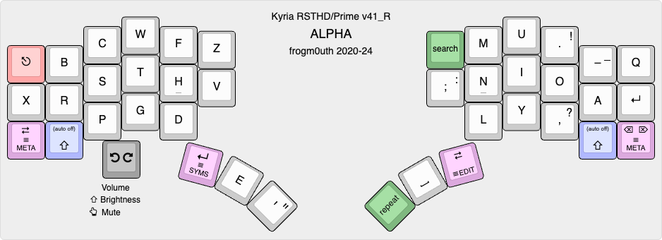

# Kyria RSTHD/Prime v41_R - Space on Right Thumb

This is the keymap with the space on the right thumb and E on the left, as in the original
[RSTHD](https://xsznix.wordpress.com/2016/05/16/introducing-the-rsthd-layout/). For the swapped version, see the [main doc](../README.md#alpha-layer).

<!--ts-->
   * [Alpha layer](#alpha-layer)
   * [Other layers](#other-layers)
      * [SYMS](#syms)
      * [EDIT](#edit)
      * [META](#meta)
      * [FUNC](#func)
      * [SNAP](#snap)

<!-- Created by https://github.com/ekalinin/github-markdown-toc -->
<!-- Added by: username, at: Sat  8 Jun 2024 19:06:49 AEST -->

<!--te-->

## Alpha layer

[KLE link](http://www.keyboard-layout-editor.com/#/gists/4b3cb8fc77dca45f1f23864446b5cde8)

The alpha layout aims to reduce lateral finger movement on the index finger. In fact, the lower keys of the inner columns have been removed entirely.

An older version of the layout performed very well in an [analyzer](docs/prime-on-the-analyzer.md), with low SFU (same finger utilization) stats and low travel distance. Since then, some changes have been made to the layout that nominally give it worse performance, because of the use of [comborolls](#comboroll-what).

*Use of this layout **requires** comborolls.*

These letters can only be accessed with comborolls: J, K and \\. These letters are usually accessed with comborolls even though they have a key: B and V. The letter M has a comboroll on the left hand to counter pin-balling off the MNL column.

The shift keys are "auto-off":
- If a shift key is held and another key is pressed, you get the shifted version of the key then shift is turned off. This completely eliminates typos like "THe".
- If a shift key is tapped, it toggles caps-word.
- If both shift keys are tapped at the same, they toggle caps-lock.

Except for Shift, there are no modifiers on the alpha layer. To access them, hold the SYMS or EDIT layer key, hold the modifier(s) down, then release the layer key. This is a bit like Callum mods except it doesn't use one-shots. This is less inconvenient than it sounds: I roll the layer key with the modifier, and common shortcuts have dedicated keys on other layers anyway.

The "repeat" thumb key is different to other implementations, in that you press it *before* the key that is to be repeated. This makes it possible to place it on the same thumb as space, as double letters often occur at the end of words.

The encoder is used to adjust volume and screen brightness.

## Other layers

There are five more layers, for a total of 6. All are hold-to-activate. The shift keys in these layers are *not* auto-off.

### SYMS

Activated by the left thumb.

[KLE layout](http://www.keyboard-layout-editor.com/#/gists/2012ee34e9234c9b0fde1ea42cbd2029)

Numbers and punctuation are combined on one layer. Numbers are along the home row and punctuation is mostly arranged on the right hand. (If only one character shown, it is output regardless of Shift.)

The punctuation is arranged so that common (for me) symbol bigrams are an inward roll: ` </ /> ~/ -> ()`. The `=` symbol is on the left hand because it combines with so many other symbols. Additional bigrams such as `/* */ => );` are on comborolls that activate if shift is held. Overall, this layer works much better for me than pre-v38 versions that used a numpad layout.

Cut, copy and paste shortcuts are along the left hand top row.

### EDIT

Activated by the right thumb.

[KLE layout](http://www.keyboard-layout-editor.com/#/gists/9232dbd3e2f90c1fcc2c12322e2a870c)

This layer extends the idea of platform-independent shortcuts to a complete layer. The left hand has the standard cursor keys, home/end and page up/down.

Modifiers are on the right hand. If one of the standard modifiers (Shift, Ctrl, Alt, Gui) is held, the emitted code is that modifier + keycode. The special modifiers on the home row act as follows:

- **Delete** makes the action delete instead of moving.
- **More** makes the key do "more" : left and right move a word left or right; home and end move to the start and end of a paragraph; page up/down move to the start and end of the document. Up and down are an exception: these activate mouse wheel scrolling.
- **X4** makes the action repeat 4 times on every keypress or repeat.
- **Fast** removes the initial repeat delay and repeats at a faster interval.

All actions have auto-repeat. You can change the special modifiers while holding down a navigation key and the action changes accordingly.

Cut, copy and paste shortcuts are along the right hand top row. Shortcuts for window and desktop navigation are scattered around the edges.

Holding one of the custom modifiers and rotating the encoder does "fast editing". (In practice though, I never use this.)

### META
Activated by either pinky.

[KLE layout](http://www.keyboard-layout-editor.com/#/gists/5945eae6fed969510415856bb98bdebf)

This layer contains common shortcuts, mostly arranged according to the letter used in the Mac/Windows shortcut. For example, the S key invokes Save (Cmd-S on Mac, Ctrl-S on Windows). However, the mapping is not always that straightforward (e.g. Cmd-Q on Mac and Alt-F4 on Windows), hence the use of a dedicated layer.

This layer also contains media control keys and the keys to access the FUNC and SNAP layers.

The encoder is used for forward and backward search.

### FUNC

Activated by the left thumb from the META layer.

[KLE layout](http://www.keyboard-layout-editor.com/#/gists/14dc100eca8495c255d54262dea19999)

This layer contains function keys on the right hand and mouse buttons on the right thumb. It also contains the keys that switch between macOS, Windows and Linux shortcuts.

### SNAP

Activated by the right thumb from the META layer.

[KLE layout](http://www.keyboard-layout-editor.com/#/gists/f4adc9e5f2957f76150b146690bf0d18)

So called because of the keys for window snapping, which snap the active window to various locations on the screen. This works on macOS if [Rectangle Pro](https://rectangleapp.com) is running; it is not working at all on Windows and Linux yet.

It also contains shortcuts for screenshots and for window zooming, as well as mouse buttons.

The encoder zooms the current application. If a modifier is held, it adjusts the OLED brightness and the backlight/per-key LEDs, depending on the modifier. There are also two keys on the left hand for this, in case there is no encoder.

